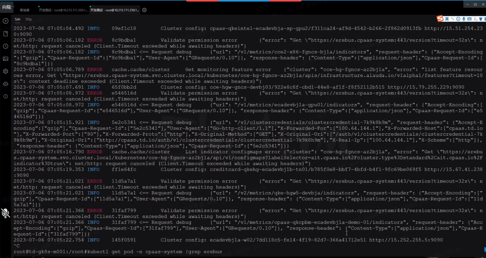
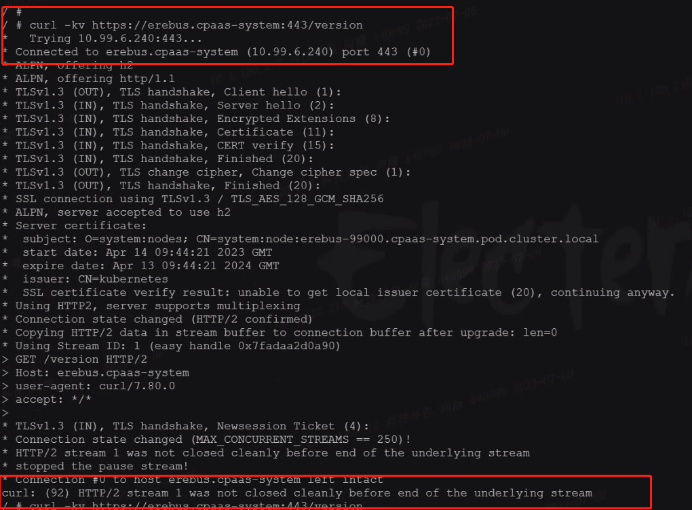

---
kind:
  - Troubleshooting
products:
  - Alauda Container Platform
  - Alauda DevOps
  - Alauda AI
  - Alauda Application Services
  - Alauda Service Mesh
  - Alauda Developer Portal
ProductsVersion:
  - 4.1.0,4.2.x
---
<!-- A type of document that involves encountering a fault, diagnosing it, performing root cause analysis, and providing solutions. -->

# 平台承载50个业务集群后出现性能问题

平台页面显示加载中，实际是链接erebus API超时 对接新K8s集群时平台挂掉 调整erebus副本数后暂时恢复

## Cause
- erebus代码存在死锁bug：新添加集群首次获取访问地址时小概率触发死锁

## Resolution
- 升级erebus镜像到v3.8.8版本（适用于3.8.2/3.10.0+版本）

## [workaround]
- 将erebus副本数调整为2副本

## [Related Information]
**Screenshots**

- Environment: TKE 3.8
- erebus组件
- erebus API
- 集群对接功能
- erebus镜像tag
- Component: Kubernetes
- Page ID: 152657718
- Original Title: 平台承载50个业务集群后出现性能问题
