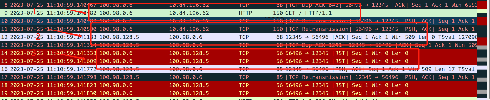

---
kind:
  - Troubleshooting
products:
  - Alauda Container Platform
  - Alauda DevOps
  - Alauda AI
  - Alauda Application Services
  - Alauda Service Mesh
  - Alauda Developer Portal
ProductsVersion:
  - 4.1.0,4.2.x
---
<!-- A type of document that involves encountering a fault, diagnosing it, performing root cause analysis, and providing solutions. -->

# ovn

pod 无法访问外部服务，报错 connection reset by peer 跨网关回包时触发 SNAT 导致 TCP 连接重置

## Cause
- natOutgoing=false 时跨网关流量未正确匹配 conntrack 记录
- 回包路径经过不同网关时触发 iptables SNAT 规则

## Resolution
- 手动添加 iptables 规则: iptables -t nat -I POSTROUTING 5 -m set ! --match-set ovn40subnets src -m set --match-set ovn40subnets dst -j RETURN

## [workaround]

## [Related Information]
**Screenshots**

- Environment: Kube-OVN v1.9.17
- natOutgoing
- ovn40subnets
- iptables POSTROUTING 链
- kube-ovn-controller
- Component: Kubernetes
- Page ID: 152665569
- Original Title: ovn-overlay，分布式网关，容器与物理网络打通后，容器内访问外部网络报错连接被重置
