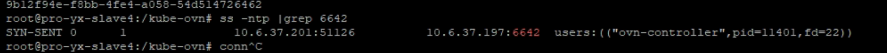
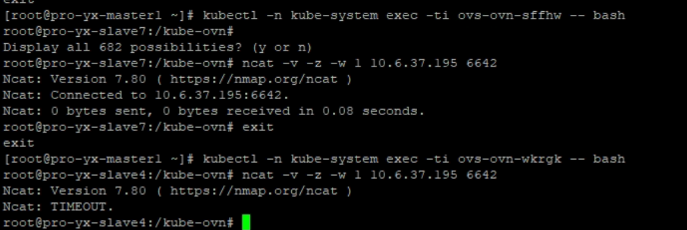

---
kind:
  - Troubleshooting
products:
  - Alauda Container Platform
  - Alauda DevOps
  - Alauda AI
  - Alauda Application Services
  - Alauda Service Mesh
  - Alauda Developer Portal
ProductsVersion:
  - 4.1.0,4.2.x
---
<!-- A type of document that involves encountering a fault, diagnosing it, performing root cause analysis, and providing solutions. -->

# 某个节点无法正常加入集群，状态一直是 NotReady

节点状态为 NotReady kube-ovn-cni 日志显示节点与 join 网关无法正常通信 ovn-controller 日志中存在无法连接 sb 的报错

## Cause
- 外部网络未开放故障节点与 SB 之间的 TCP 端口

## Resolution
- 调整外部网络策略，开放故障节点与 SB 之间的 TCP 端口

## [workaround]

## [Related Information]
**Screenshots**

- kube-ovn-cni
- ovn-controller
- /etc/cni/net.d
- Component: Kubernetes
- Page ID: 158335083
- Original Title: 某个节点无法正常加入集群，状态一直是 NotReady
