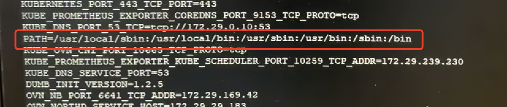

---
kind:
  - Troubleshooting
products:
  - Alauda Container Platform
  - Alauda DevOps
  - Alauda AI
  - Alauda Application Services
  - Alauda Service Mesh
  - Alauda Developer Portal
ProductsVersion:
  - 4.1.0,4.2.x
---
<!-- A type of document that involves encountering a fault, diagnosing it, performing root cause analysis, and providing solutions. -->

# exec: "ovs

pod 无法正常删除 kube-ovn-cni 报错 ovs-vsctl not found in $PATH

## Cause
- 第三方安全工具 G01 导致 kube-ovn-daemon 进程的 PATH 环境变量异常

## Resolution
- 卸载 G01 安全工具
- 重建 kube-ovn-cni

## [workaround]

## [Related Information]
**Screenshots**

- kube-ovn-cni
- kube-ovn-daemon
- G01
- PATH 环境变量
- Component: Kubernetes
- Page ID: 158335138
- Original Title: exec: "ovs-vsctl": executable file not found in $PATH
