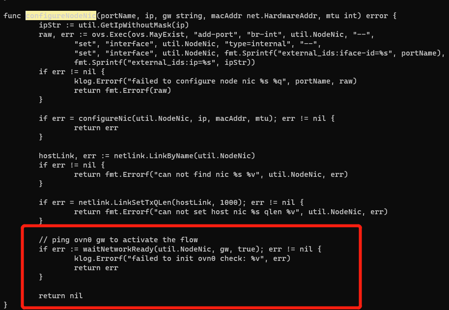

---
kind:
  - Troubleshooting
products:
  - Alauda Container Platform
  - Alauda DevOps
  - Alauda AI
  - Alauda Application Services
  - Alauda Service Mesh
  - Alauda Developer Portal
ProductsVersion:
  - 4.1.0,4.2.x
---
<!-- A type of document that involves encountering a fault, diagnosing it, performing root cause analysis, and providing solutions. -->

# 新加入的节点，kube

kube-ovn-cni启动失败 ping ovn0卡住不通 ovn-controller出现transaction error日志

## Cause
- sb数据库存在未清理的chassis残留数据(节点剔除后重新加入导致)

## Resolution
- 重新恢复ovn数据库

## [workaround]

## [Related Information]
**Screenshots**

- Environment: CNI 版本：Kube-OVN v1.7.3
- ovn-controller
- kube-ovn-cni
- ovn-central
- sb数据库
- ovn0
- Component: Kubernetes
- Page ID: 158794176
- Original Title: 新加入的节点，kube-ovn-cni启动失败
