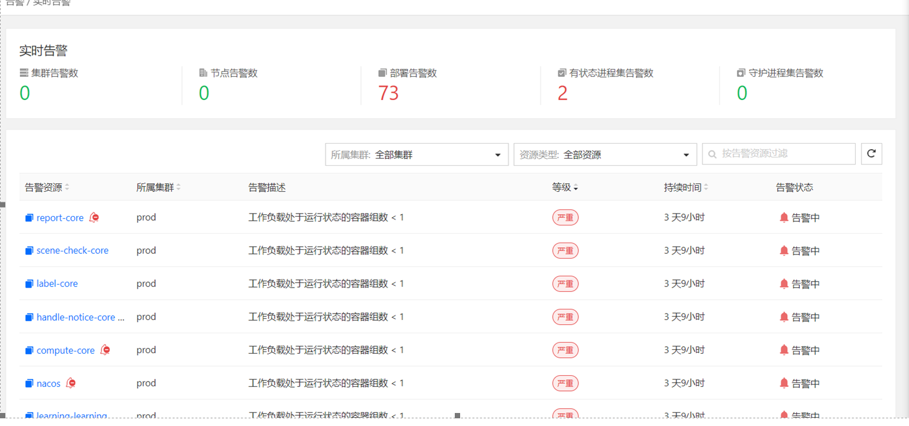
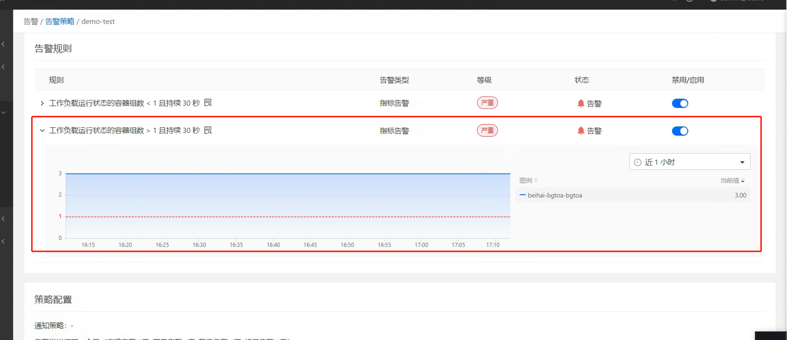
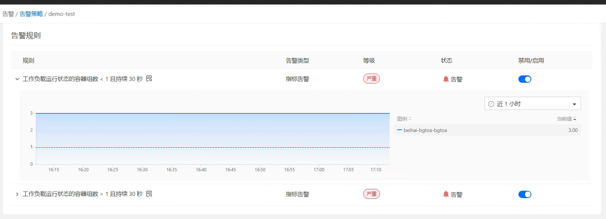
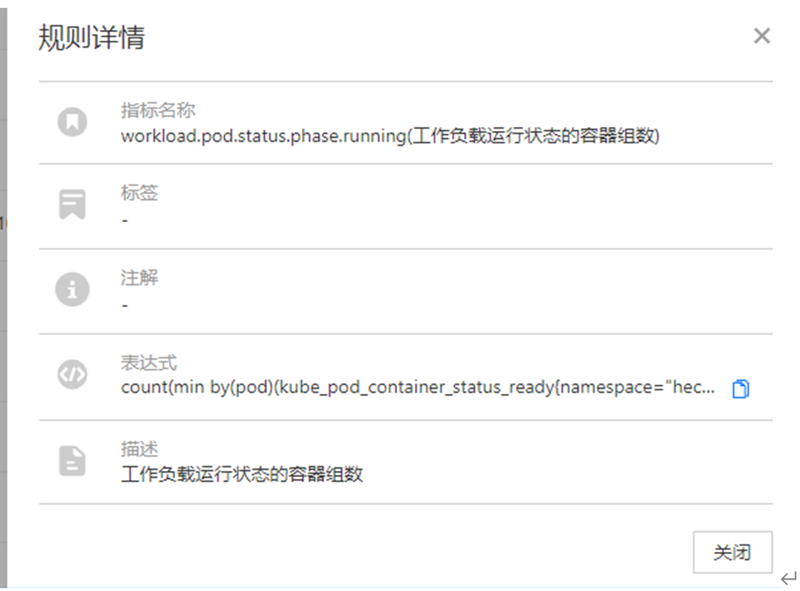
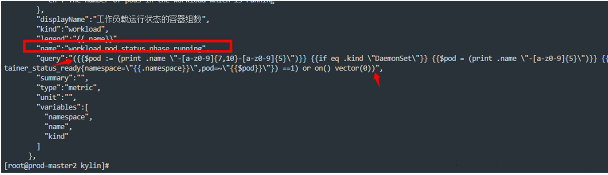
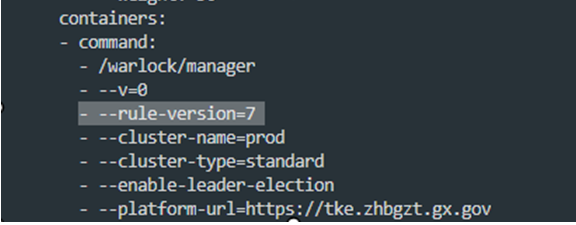
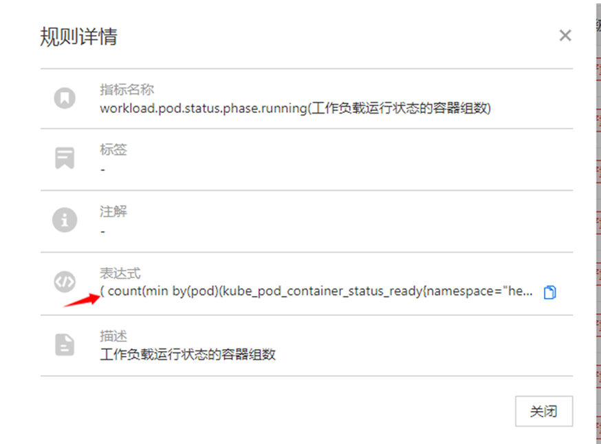

---
kind:
  - Troubleshooting
products:
  - Alauda Container Platform
  - Alauda DevOps
  - Alauda AI
  - Alauda Application Services
  - Alauda Service Mesh
  - Alauda Developer Portal
ProductsVersion:
  - 4.1.0,4.2.x
---
<!-- A type of document that involves encountering a fault, diagnosing it, performing root cause analysis, and providing solutions. -->

# 3.6.2

工作负载运行状态的容器组数告警（workload.pod.status.phase.running）持续触发，无法通过调整阈值消除

## Cause
- 3.6.2版本中告警规则表达式存在缺陷

## Resolution
- 修改 ConfigMap indicators-standard-workload-1，在 pod.status.phase.running 的 query 字段添加英文小括号
- 修改 Deployment warlock，在启动参数中添加 '- --rule-version=7'

## [workaround]

## [Related Information]
**Screenshots**

- Environment: 3.6.2
- indicators-standard-workload-1
- warlock
- workload.pod.status.phase.running
- kube_pod_container_status_ready
- Component: Kubernetes
- Page ID: 161385193
- Original Title: 3.6.2-针对工作负载运行状态的容器组数告警的bug修复方案
