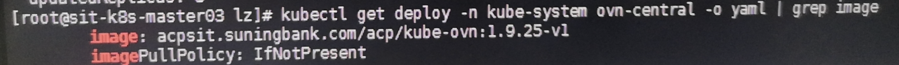
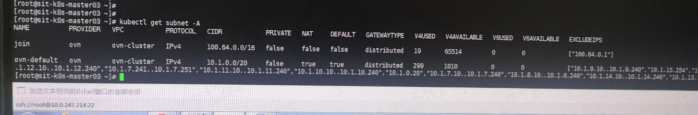
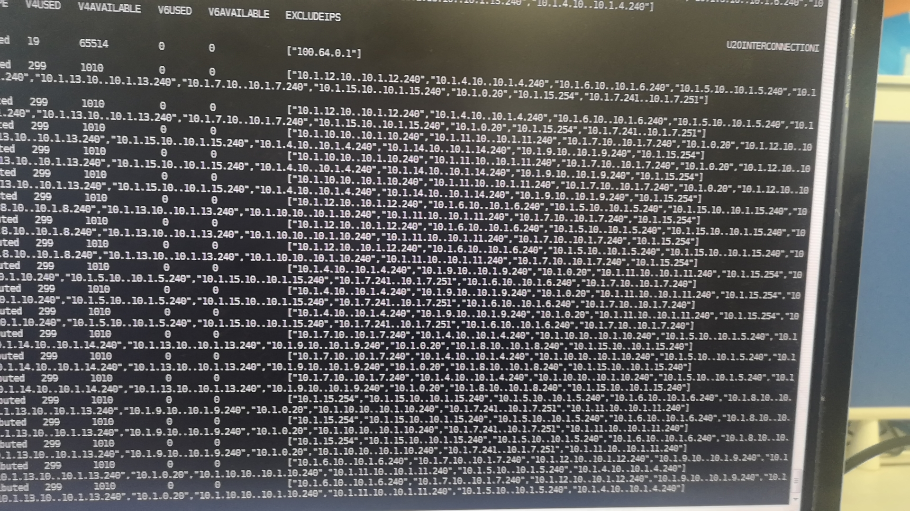
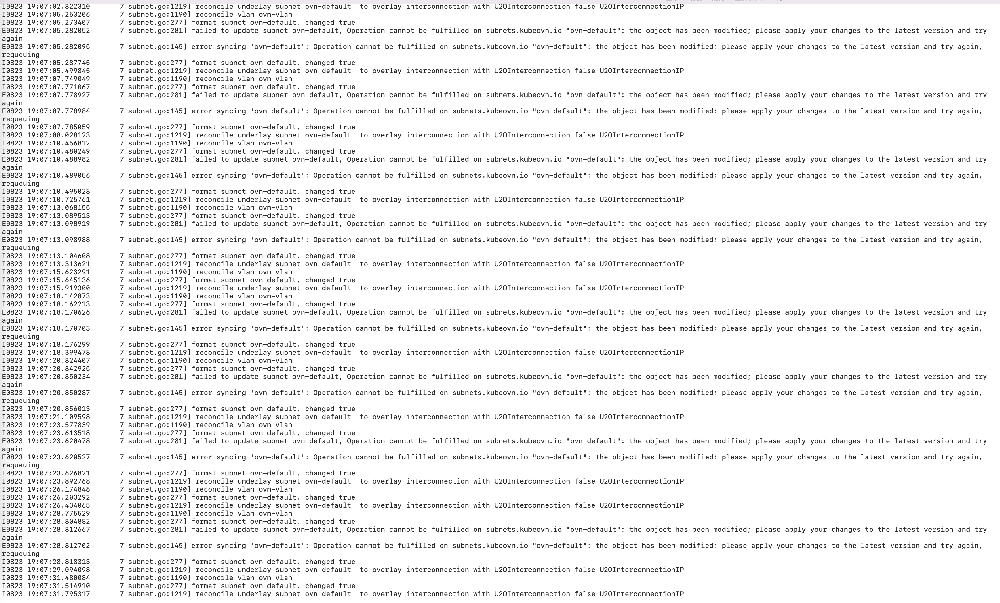

---
kind:
  - Troubleshooting
products:
  - Alauda Container Platform
  - Alauda DevOps
  - Alauda AI
  - Alauda Application Services
  - Alauda Service Mesh
  - Alauda Developer Portal
ProductsVersion:
  - 4.1.0,4.2.x
---
<!-- A type of document that involves encountering a fault, diagnosing it, performing root cause analysis, and providing solutions. -->

# 苏宁银行 ns 导入问题

ns导入失败 ns的annotation不断刷新 subnet的excludeIPs字段持续更新

## Cause
- 子网持续更新excludeIPs字段导致annotation刷新

## Resolution
- 删除excludeIPs字段后恢复
- 建议更新hotfix镜像后再确认

## [workaround]

## [Related Information]
**Screenshots**

- Environment: CNI版本: kube-ovn 1.9.25特定commit点, ACP版本: v3.12.1
- subnet
- annotation
- excludeIPs
- kube-ovn
- ACP
- Component: Kubernetes
- Page ID: 161386869
- Original Title: 苏宁银行 ns 导入问题
