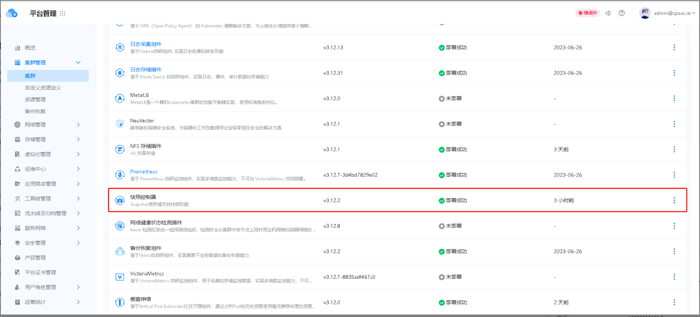
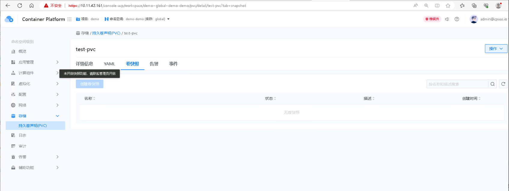
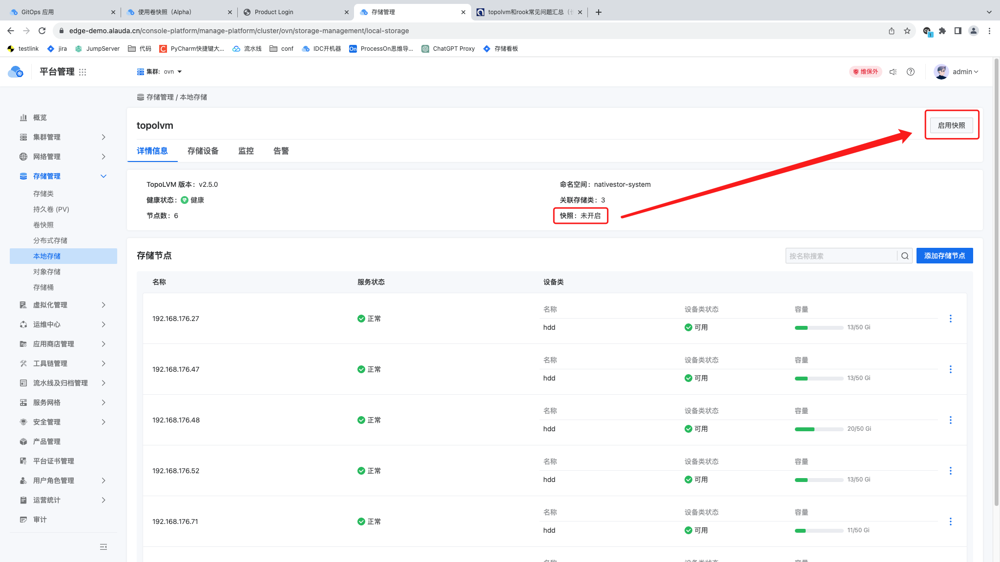

---
kind:
  - Troubleshooting
products:
  - Alauda Container Platform
  - Alauda DevOps
  - Alauda AI
  - Alauda Application Services
  - Alauda Service Mesh
  - Alauda Developer Portal
ProductsVersion:
  - 4.1.0,4.2.x
---
<!-- A type of document that involves encountering a fault, diagnosing it, performing root cause analysis, and providing solutions. -->

# ACP3.12.1 集群部署了快照插件，无法创建卷快照

PVC卷快照处显示未部署插件

## Cause
- 缺少csi-topolvm-snapshotclass VolumeSnapshotClass资源

## Resolution
- 创建csi-topolvm-snapshotclass VolumeSnapshotClass资源：kubectl create -f <yaml文件>

## [workaround]
- 通过存储管理界面启用快照功能

## [Related Information]
**Screenshots**

- Environment: ACP 3.12.1
- VolumeSnapshotClass(vsclass)
- PVC
- 存储管理界面
- csi-topolvm-snapshotclass
- Component: Kubernetes
- Page ID: 163054282
- Original Title: ACP3.12.1 集群部署了快照插件，无法创建卷快照
