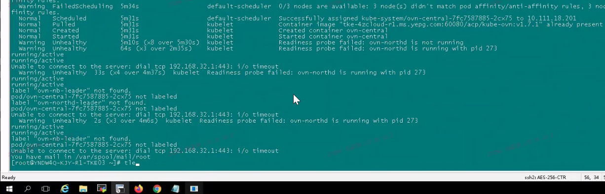

---
kind:
  - Troubleshooting
products:
  - Alauda Container Platform
  - Alauda DevOps
  - Alauda AI
  - Alauda Application Services
  - Alauda Service Mesh
  - Alauda Developer Portal
ProductsVersion:
  - 4.1.0,4.2.x
---
<!-- A type of document that involves encountering a fault, diagnosing it, performing root cause analysis, and providing solutions. -->

# ovn

ovn-central pod启动失败 192.168.32.1:443 i/o timeout错误 节点curl 192.168.32.1:443概率性不通(1/5)

## Cause
- 客户护网期间添加的iptables规则导致6443端口流量被DROP

## Resolution
- 清理护网期间添加的iptables规则

## [workaround]

## [Related Information]
**Screenshots**

- Environment: CNI版本：Kube-OVN v1.7.1
- 6443/tcp
- iptables
- Kube-OVN
- 172.16.0.0/16
- Component: Kubernetes
- Page ID: 163056511
- Original Title: ovn-central启动失败问题
