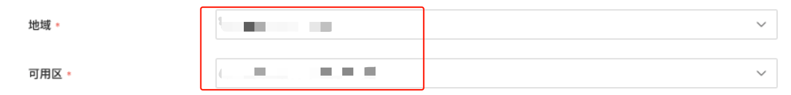

---
kind:
  - Troubleshooting
products:
  - Alauda Container Platform
  - Alauda DevOps
  - Alauda AI
  - Alauda Application Services
  - Alauda Service Mesh
  - Alauda Developer Portal
ProductsVersion:
  - 4.1.0,4.2.x
---
<!-- A type of document that involves encountering a fault, diagnosing it, performing root cause analysis, and providing solutions. -->

# 平台对接阿里飞天存储

CSI插件部署失败 PVC无法绑定PV 存储类创建失败

## Cause
- AK/SK权限不足
- Endpoint配置格式错误
- 镜像地址未修改为私有仓库
- 网络未互通
- region_id与实际环境不匹配

## Resolution
- 检查RBAC权限策略是否包含文档要求的API权限
- 验证ECS_ENDPOINT格式为ecs.domain，NAS_ENDPOINT格式为nas.region.domain
- 修改部署yaml中的image字段为私有仓库地址
- 执行网络连通性测试确保集群与存储服务通信正常
- 核对REGION_ID与飞天云实际区域ID一致

## [workaround]
- 在内网环境提前拉取镜像并推送到私有仓库
- 对OSS存储使用静态PV绑定方式
- NAS存储创建时设置persistentVolumeReclaimPolicy=Retain

## [Related Information]
**Screenshots**

- Environment: 飞天私有云Enterprise_v3.16.2, Kubernetes v1.24.9, 平台3.12.1, x86架构
- diskplugin.csi.alibabacloud.com
- nasplugin.csi.alibabacloud.com
- ossplugin.csi.alibabacloud.com
- /var/lib/kubelet/csi-provisioner
- ALICLOUD_CLIENT_SCHEME
- ECS_ENDPOINT
- NAS_ENDPOINT
- Component: Kubernetes
- Page ID: 163060250
- Original Title: 平台对接阿里飞天存储
