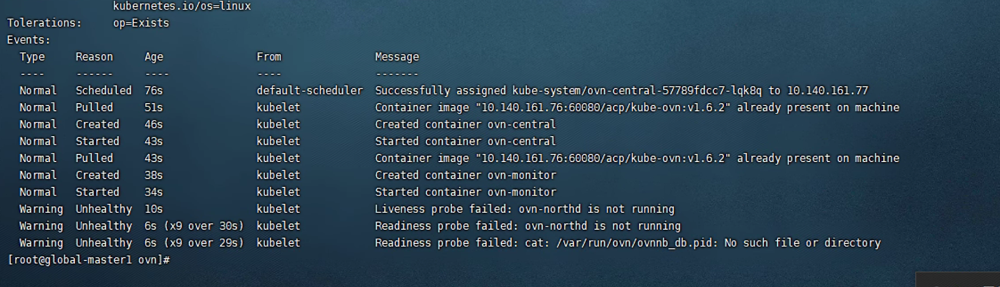
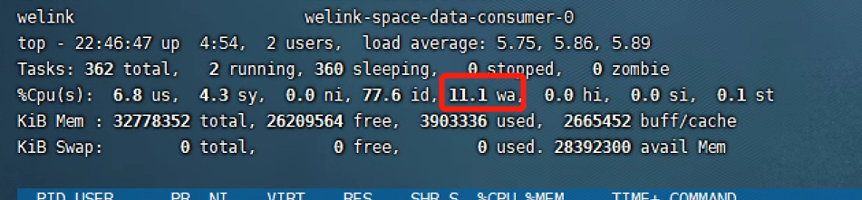

---
kind:
  - Troubleshooting
products:
  - Alauda Container Platform
  - Alauda DevOps
  - Alauda AI
  - Alauda Application Services
  - Alauda Service Mesh
  - Alauda Developer Portal
ProductsVersion:
  - 4.1.0,4.2.x
---
<!-- A type of document that involves encountering a fault, diagnosing it, performing root cause analysis, and providing solutions. -->

# 国电投ovn

ovn-central全部起不来 删除/etc/orgin/ovn/后仍无法恢复 kubectl操作及删除pod缓慢

## Cause
- 磁盘读写问题（wa过高）

## Resolution
- 删除ovn-central的livenesss探针

## [workaround]
- 删除ovn-central的livenesss探针

## [Related Information]
**Screenshots**

- Environment: Kubernetes acp 3.4, CNI kube-ovn:v1.6.2
- ovn-central
- livenesss
- /etc/orgin/ovn/
- kube-ovn:v1.6.2
- Component: Kubernetes
- Page ID: 163079002
- Original Title: 国电投ovn-central起不来
