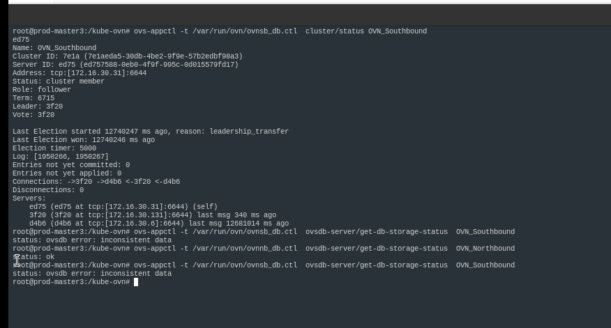

---
kind:
  - Troubleshooting
products:
  - Alauda Container Platform
  - Alauda DevOps
  - Alauda AI
  - Alauda Application Services
  - Alauda Service Mesh
  - Alauda Developer Portal
ProductsVersion:
  - 4.1.0,4.2.x
---
<!-- A type of document that involves encountering a fault, diagnosing it, performing root cause analysis, and providing solutions. -->

# 华西办公厅 SB 数据库 inconstistent data

SB 数据库 inconsistent data

## Cause
- 旧版本ovn-northd的bug（1.9之前版本）

## Resolution
- 踢出有问题的节点，清理本地db后重新加入sb集群，参考方法：https://kubeovn.github.io/docs/v1.10.x/ops/recover-db/

## [workaround]

## [Related Information]
**Screenshots**

- Environment: 麒麟操作系统，CNI版本1.7
- ovn-northd
- SB 数据库
- raft
- https://kubeovn.github.io/docs/v1.10.x/ops/recover-db/
- Component: Kubernetes
- Page ID: 163082689
- Original Title: 华西办公厅 SB 数据库 inconstistent data
