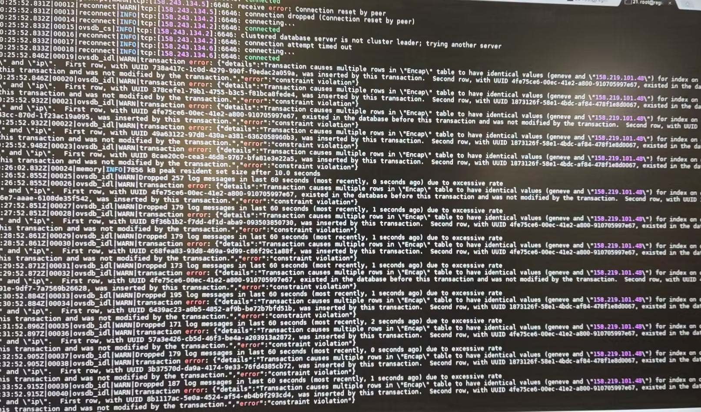

---
kind:
  - Troubleshooting
products:
  - Alauda Container Platform
  - Alauda DevOps
  - Alauda AI
  - Alauda Application Services
  - Alauda Service Mesh
  - Alauda Developer Portal
ProductsVersion:
  - 4.1.0,4.2.x
---
<!-- A type of document that involves encountering a fault, diagnosing it, performing root cause analysis, and providing solutions. -->

# 集群互联 OVN

跨集群 Pod IP 不通

## Cause
- 重建集群后重新加入集群互联导致旧 chassis 资源冲突

## Resolution
- 在 ovn-ic-db 容器(leader)执行 ovn-ic-sbctl destroy gateway/availability_zone xxxx 清理冲突资源

## [workaround]

## [Related Information]
**Screenshots**

- Environment: CNI v1.9.25, ACP v3.12
- kube-ovn-controller
- /var/log/ovn/ovn-ic.log
- ovn-ic-db
- ovn-ic-sbctl
- Component: Kubernetes
- Page ID: 165015203
- Original Title: 集群互联 OVN-IC 偶现跨集群 Pod IP 不通
