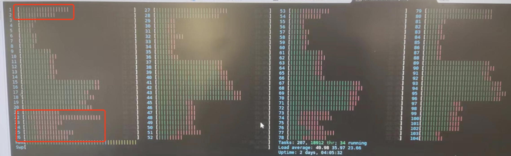

---
kind:
  - Troubleshooting
products:
  - Alauda Container Platform
  - Alauda DevOps
  - Alauda AI
  - Alauda Application Services
  - Alauda Service Mesh
  - Alauda Developer Portal
ProductsVersion:
  - 4.1.0,4.2.x
---
<!-- A type of document that involves encountering a fault, diagnosing it, performing root cause analysis, and providing solutions. -->

# 集群互联 OVN

应用绑定的 CPU Core 使用率达到 ~100%，软中断占用高

## Cause
- OVN-IC 集群互联的 Mellanox 25G 网卡软中断（mlx5_xxx@pci:0000:98:00.0）集中在部分 CPU Core

## Resolution
- 停止 irqbalance 服务: systemctl stop irqbalance
- 手动绑定网卡中断到未绑定应用的 CPU Core
- 配置 OVN-IC 使用 ECMP 路由实现流量均衡
- 升级 kube-ovn 到 v1.11 并确保 ovn-ic db 升级 route_table 字段

## [workaround]

## [Related Information]
**Screenshots**

- Environment: CNI v1.9.25, ACP v3.12
- mlx5_xxx@pci:0000:98:00.0
- /proc/interrupts
- kube-ovn-controller
- ECMP 路由
- ovn-ic sb 数据库
- Component: Kubernetes
- Page ID: 165015268
- Original Title: 集群互联 OVN-IC 网关节点 CPU 软中断过高
