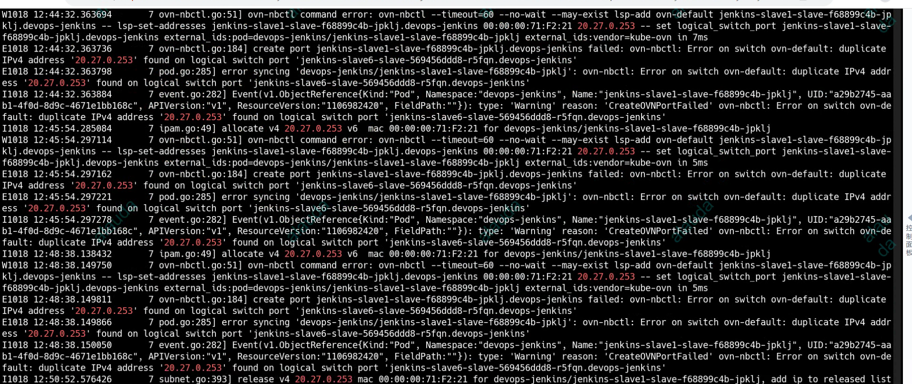
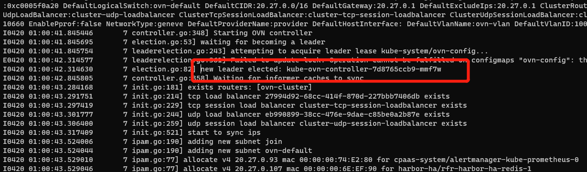
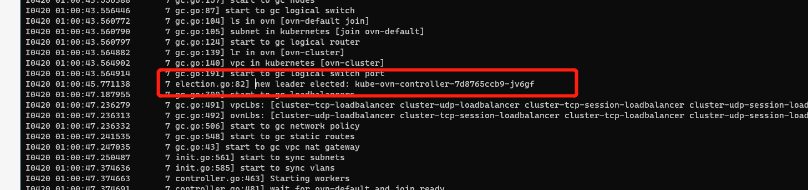
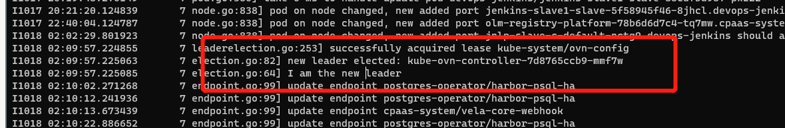

---
kind:
  - Troubleshooting
products:
  - Alauda Container Platform
  - Alauda DevOps
  - Alauda AI
  - Alauda Application Services
  - Alauda Service Mesh
  - Alauda Developer Portal
ProductsVersion:
  - 4.1.0,4.2.x
---
<!-- A type of document that involves encountering a fault, diagnosing it, performing root cause analysis, and providing solutions. -->

# 宝信ip冲突

pod创建失败 kube-ovn-controller日志显示相同IP的lsp已被分配

## Cause
- kube-ovn-controller存在多个leader导致IPAM未同步

## Resolution
- 重启kube-ovn-controller pod触发重新选主并初始化IPAM

## [workaround]

## [Related Information]
**Screenshots**

- Environment: Kubernetes with kube-ovn 1.8.14 CNI
- kube-ovn-controller
- ipam
- lsp
- Component: Kubernetes
- Page ID: 165015811
- Original Title: 宝信ip冲突
