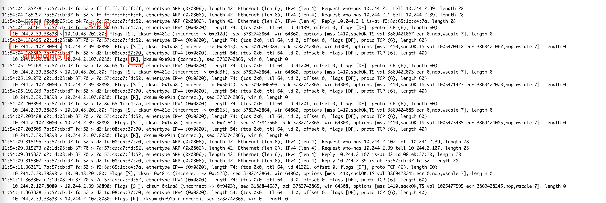

---
kind:
  - Troubleshooting
products:
  - Alauda Container Platform
  - Alauda DevOps
  - Alauda AI
  - Alauda Application Services
  - Alauda Service Mesh
  - Alauda Developer Portal
ProductsVersion:
  - 4.1.0,4.2.x
---
<!-- A type of document that involves encountering a fault, diagnosing it, performing root cause analysis, and providing solutions. -->

# 3.14.1发版，access 集群，flannel 同节点svc 访问不通

同节点svc访问不通

## Cause
- 节点重启后系统参数net.bridge.bridge-nf-call-iptables丢失未生效

## Resolution
- 设置系统参数：net.bridge.bridge-nf-call-iptables = 1

## [workaround]

## [Related Information]
**Screenshots**

- Environment: 原生Kubernetes access集群，开源flannel插件
- flannel
- net.bridge.bridge-nf-call-iptables
- kube-proxy
- Component: Kubernetes
- Page ID: 168303820
- Original Title: 3.14.1发版，access 集群，flannel 同节点svc 访问不通
