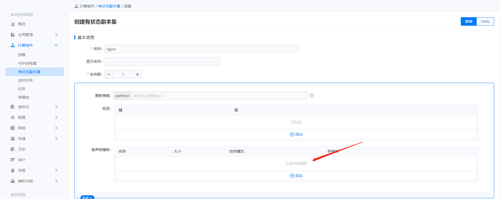

---
kind:
  - Troubleshooting
products:
  - Alauda Container Platform
  - Alauda DevOps
  - Alauda AI
  - Alauda Application Services
  - Alauda Service Mesh
  - Alauda Developer Portal
ProductsVersion:
  - 4.1.0,4.2.x
---
<!-- A type of document that involves encountering a fault, diagnosing it, performing root cause analysis, and providing solutions. -->

# sts应用不同pod分配不同pvc（给sts应用动态匹配pvc）

sts应用扩容时无法为每个pod动态分配不同的pvc

## Cause
- 未使用卷声明模板(volumeClaimTemplates)配置
- 未创建对应的存储类(StorageClass)

## Resolution
- 创建支持动态供给的存储类(StorageClass)
- 在StatefulSet中配置volumeClaimTemplates字段
- 将volumeClaimTemplates挂载到容器路径
- 通过kubectl scale命令扩容StatefulSet实例

## [workaround]

## [Related Information]
**Screenshots**
（3.12版本通过卷声明模板来实现该需求，前提：需对应创建存储类。）
- Environment: All
- volumeClaimTemplates
- StorageClass
- StatefulSet
- PersistentVolume
- PersistentVolumeClaim
- Component: Kubernetes
- Page ID: 168307585
- Original Title: sts应用不同pod分配不同pvc（给sts应用动态匹配pvc）
