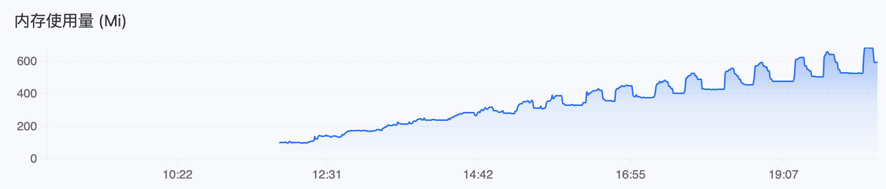
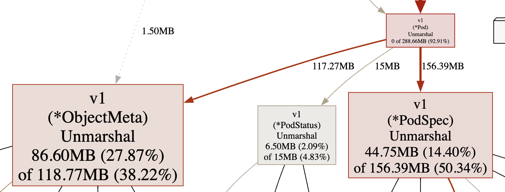

---
kind:
  - Troubleshooting
products:
  - Alauda Container Platform
  - Alauda DevOps
  - Alauda AI
  - Alauda Application Services
  - Alauda Service Mesh
  - Alauda Developer Portal
ProductsVersion:
  - 4.1.0,4.2.x
---
<!-- A type of document that involves encountering a fault, diagnosing it, performing root cause analysis, and providing solutions. -->

# kube

kube-ovn-controller 内存使用持续增长 workqueue_depth{name="delPodAnnotatedIptablesEip"} 和 workqueue_depth{name="delPodAnnotatedIptablesFip"} 指标持续上涨 存在约 50 个 Completed 状态的 Pod（删除后内存仍上涨）

## Cause
- k8s client workqueue 中 delPodAnnotatedIptablesEip/delPodAnnotatedIptablesFip 队列深度持续增长导致内存泄漏
- 代码逻辑缺陷导致队列任务堆积

## Resolution
- 应用修复补丁 <https://github.com/kubeovn/kube-ovn/pull/3366>
- 更新 kube-ovn-controller 镜像版本

## [workaround]

## [Related Information]
**Screenshots**

- workqueue_depth 指标
- delPodAnnotatedIptablesEip
- delPodAnnotatedIptablesFip
- Pod Annotations
- kube-ovn-controller
- Component: Kubernetes
- Page ID: 168313425
- Original Title: kube-ovn-controller 内存泄漏
