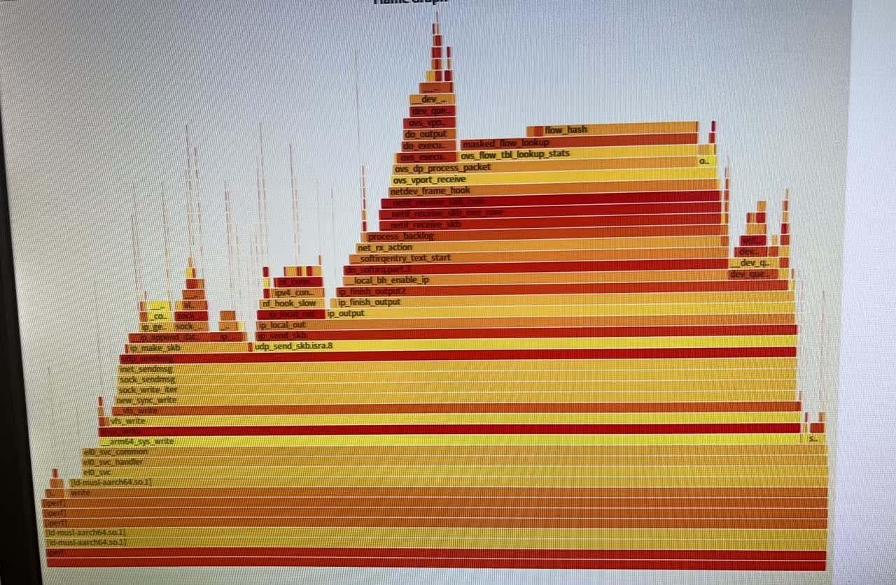
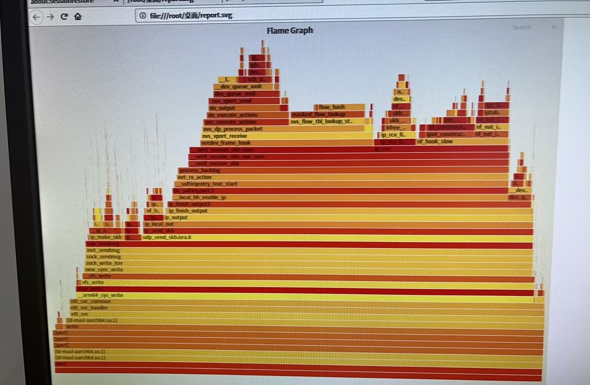
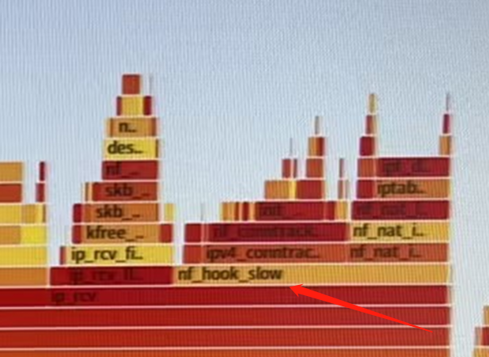
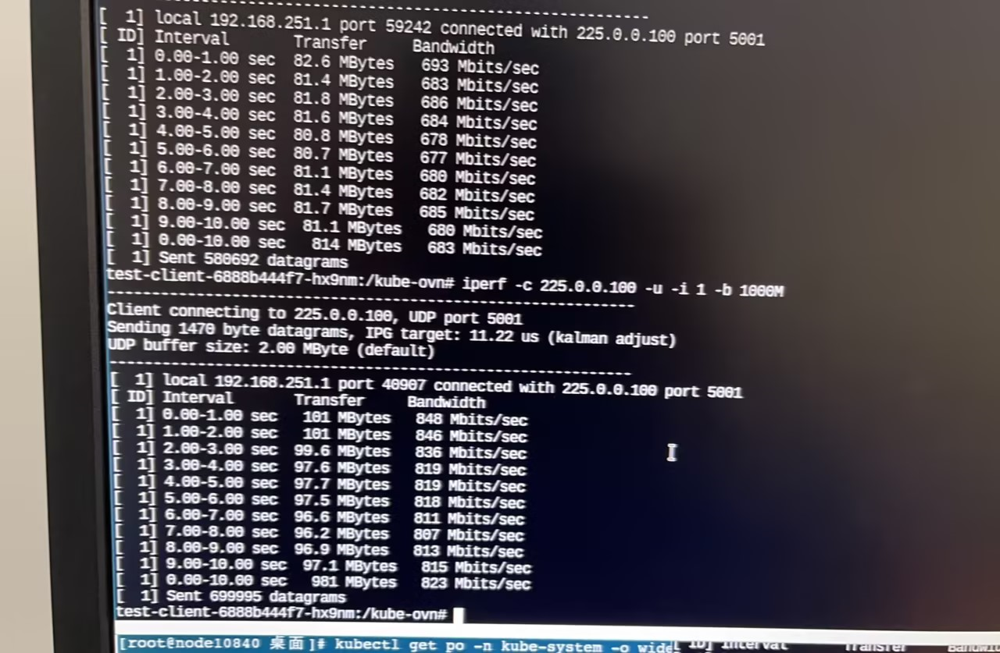
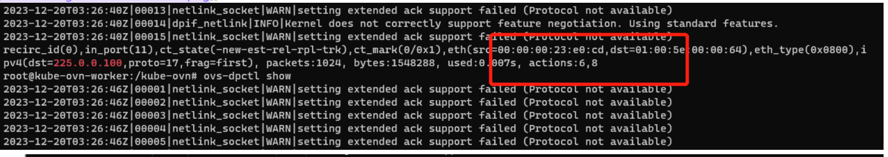
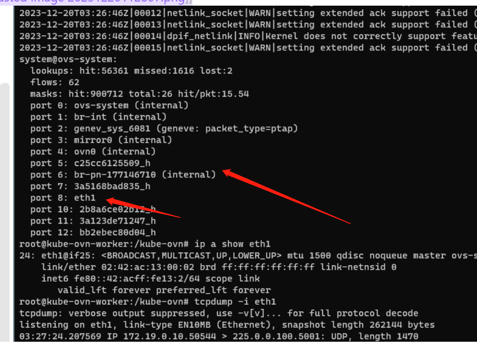
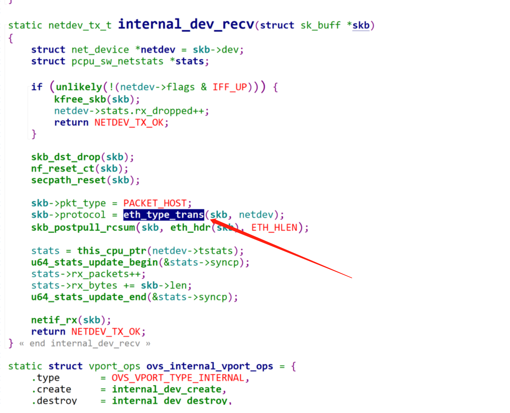

---
kind:
  - Troubleshooting
products:
  - Alauda Container Platform
  - Alauda DevOps
  - Alauda AI
  - Alauda Application Services
  - Alauda Service Mesh
  - Alauda Developer Portal
ProductsVersion:
  - 4.1.0,4.2.x
---
<!-- A type of document that involves encountering a fault, diagnosing it, performing root cause analysis, and providing solutions. -->

# 电科院跨节点组播性能调优

跨节点组播性能700Mbits，低于单播的950Mbits 组播火焰图显示多出ip_rcv逻辑，可能因组播报文环回本地导致额外处理 配置iptables规则跳过nf_hook_slow后，组播性能提升至800Mbits

## Cause
- 组播报文在underlay网络中经过internal类型的br-provider网桥，触发eth_type_trans逻辑
- 组播报文在环回处理时可能进入ip_rcv路径，导致额外开销

## Resolution
- 清理br-provider网桥以消除ip_rcv路径
- 调整网络配置避免组播报文进入额外处理逻辑

## [workaround]
- 添加iptables规则：iptables -t raw -A PREROUTING -d {组播IP} -j NOTRACK

## [Related Information]
**Screenshots**

- Environment: 飞腾操作系统，Kubernetes，CNI v1.9.29
- iptables
- br-provider
- nf_hook_slow
- conntrack
- IP_MULTICAST_LOOP
- eth_type_trans
- Component: Kubernetes
- Page ID: 170363885
- Original Title: 电科院跨节点组播性能调优
