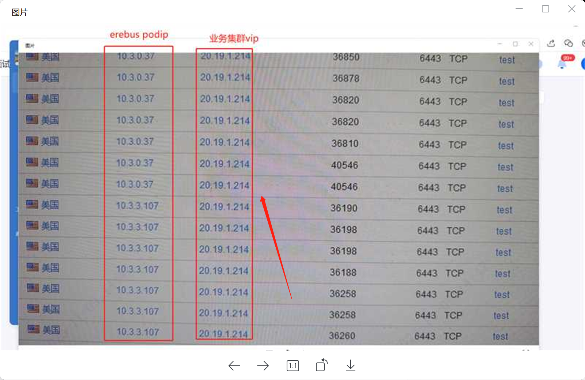
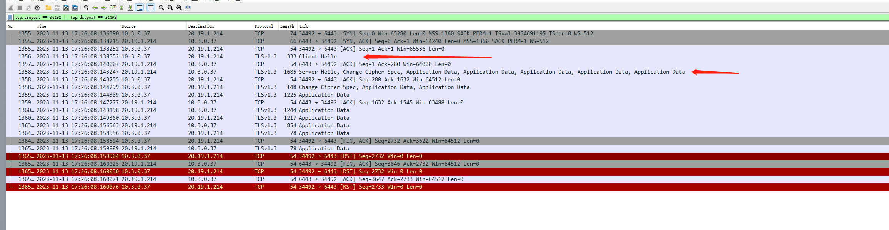
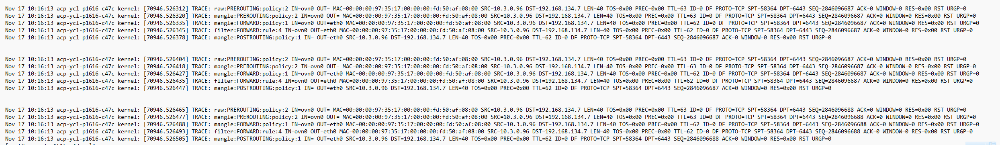
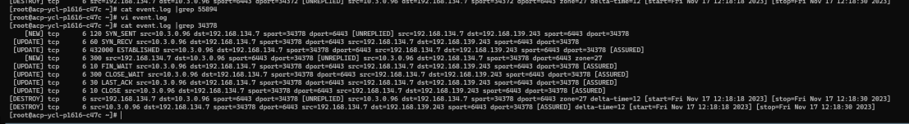
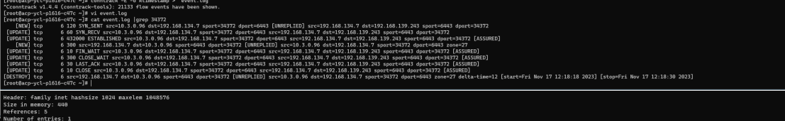
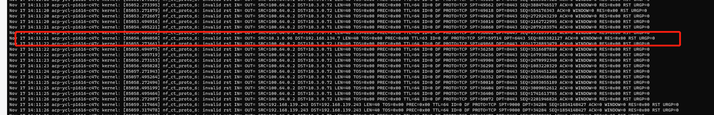
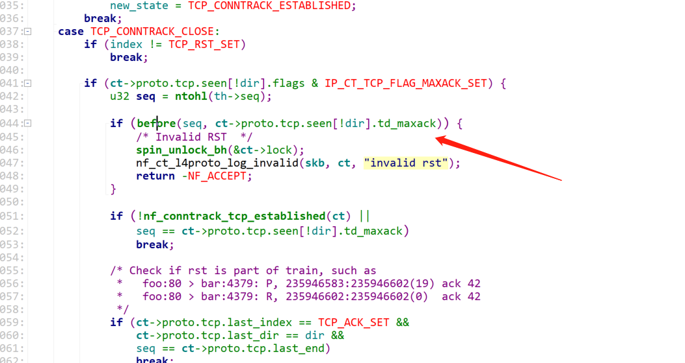
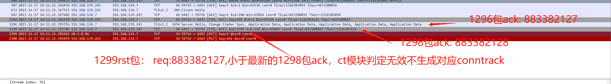

---
kind:
  - Troubleshooting
products:
  - Alauda Container Platform
  - Alauda DevOps
  - Alauda AI
  - Alauda Application Services
  - Alauda Service Mesh
  - Alauda Developer Portal
ProductsVersion:
  - 4.1.0,4.2.x
---
<!-- A type of document that involves encountering a fault, diagnosing it, performing root cause analysis, and providing solutions. -->

# 温州银行  容器出网未做snat

erebus pod不断向业务集群vip发送未经snat的报文 物理网卡出现大量未snat的rst报文 conntrack中存在大量[unreplied]状态条目

## Cause
- 当发送rst报文时，若rst的seq小于反方向最大ack值，会导致conntrack状态更新失败
- snat动作依赖conntrack表项，当ct状态更新失败时导致snat异常

## Resolution
- 添加iptables规则丢弃无效状态包：iptables -I POSTROUTING -t mangle -m state --state INVALID -j DROP
- 升级kube-ovn到1.11版本重构iptables规则

## [workaround]
- 临时丢弃未做snat的报文：iptables -I POSTROUTING -t mangle -m state --state INVALID -j DROP

## [Related Information]
**Screenshots**

- Environment: Kubernetes 3.12.1 + kube-ovn 1.9.25
- kube-ovn
- iptables/nat表
- conntrack模块
- nf_conntrack_tcp_packet内核函数
- Component: Kubernetes
- Page ID: 171901718
- Original Title: 温州银行  容器出网未做snat
