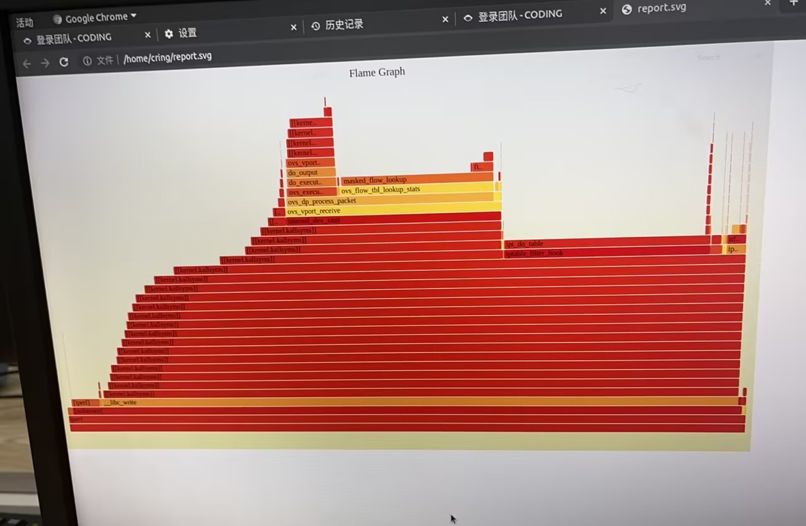
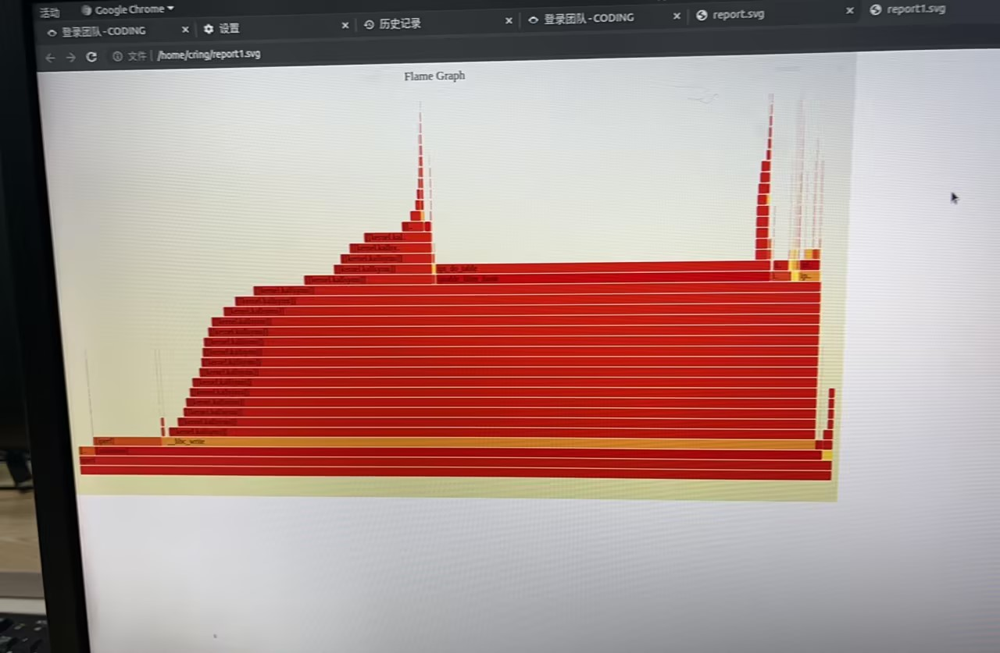
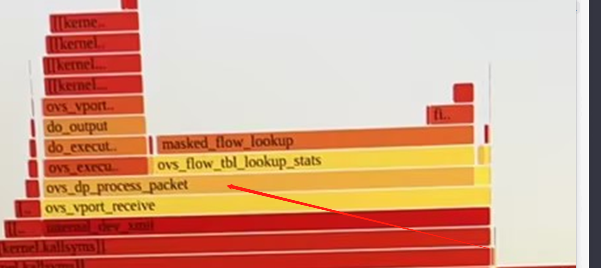
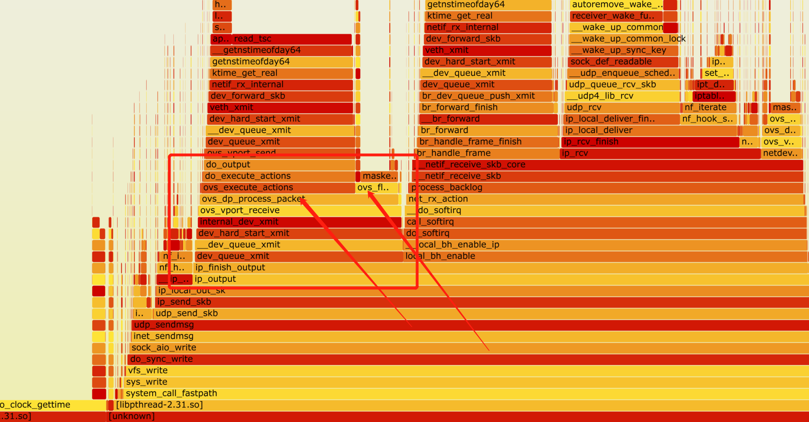
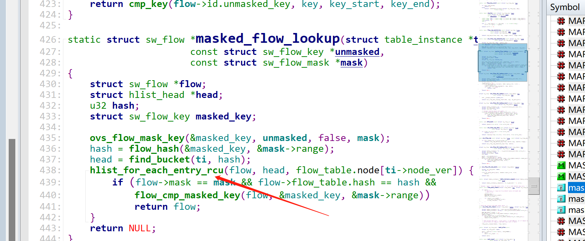

---
kind:
  - Troubleshooting
products:
  - Alauda Container Platform
  - Alauda DevOps
  - Alauda AI
  - Alauda Application Services
  - Alauda Service Mesh
  - Alauda Developer Portal
ProductsVersion:
  - 4.1.0,4.2.x
---
<!-- A type of document that involves encountering a fault, diagnosing it, performing root cause analysis, and providing solutions. -->

# 电科院x86平台万兆网卡，部署了underlay后性能会降低

节点间udp带宽从6Gbits降低到2Gbits 添加underlay subnet后出现masked_flow_lookup耗时增加

## Cause
- 节点IP配置在underlay的ovs internal类型网卡br-eth0上
- 万兆网卡流量暴露了ovs内核报文处理逻辑的rcu性能问题

## Resolution
- 改用overlay网络管理节点IP
- underlay网络单独使用物理网卡

## [workaround]

## [Related Information]
**Screenshots**

- Environment: x86平台/万兆网卡/underlay网络/CNI v1.9.29
- ovs-dpctl dump-flows | wc -l
- br-eth0
- masked_flow_lookup
- rcu机制
- underlay subnet配置
- Component: Kubernetes
- Page ID: 176883148
- Original Title: 电科院x86平台万兆网卡，部署了underlay后性能会降低
