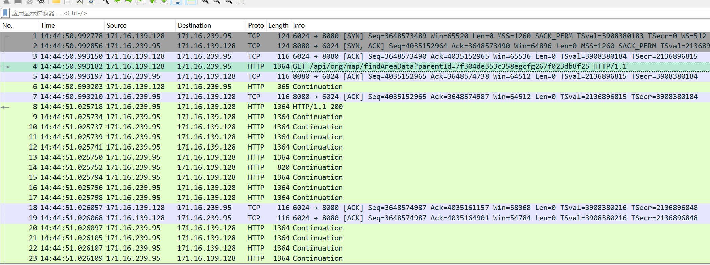
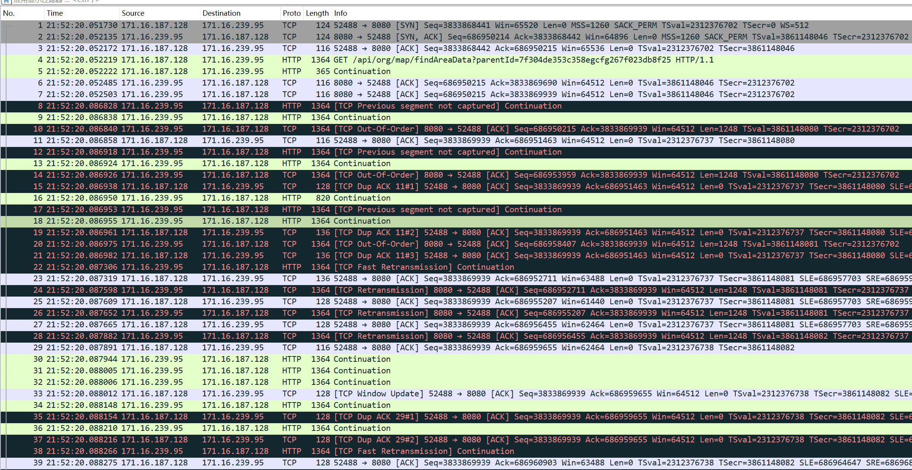

---
kind:
  - Troubleshooting
products:
  - Alauda Container Platform
  - Alauda DevOps
  - Alauda AI
  - Alauda Application Services
  - Alauda Service Mesh
  - Alauda Developer Portal
ProductsVersion:
  - 4.1.0,4.2.x
---
<!-- A type of document that involves encountering a fault, diagnosing it, performing root cause analysis, and providing solutions. -->

# 跨 VPC 性能极低

跨 VPC 通过 Pod IP 调用 HTTP 接口下载 5MB 文件耗时 5~10s 同 VPC 内调用不到 1s

## Cause
- VXLAN 封装包出现乱序导致频繁丢包及重传

## Resolution
- 由 Iaas 排查 VXLAN 乱序问题

## [workaround]

## [Related Information]
**Screenshots**

- VXLAN
- Pod IP
- curl
- HTTP 接口
- Component: Kubernetes
- Page ID: 178225526
- Original Title: 跨 VPC 性能极低
