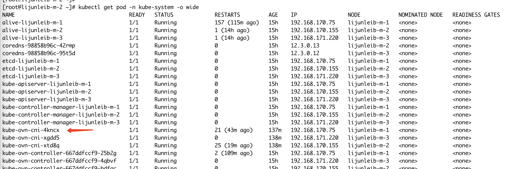
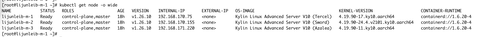
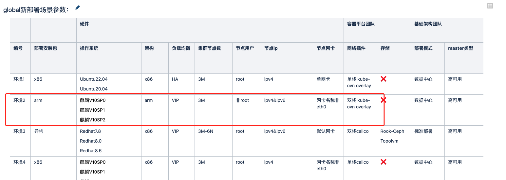
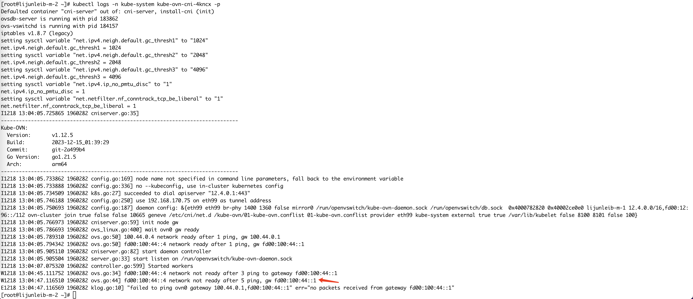
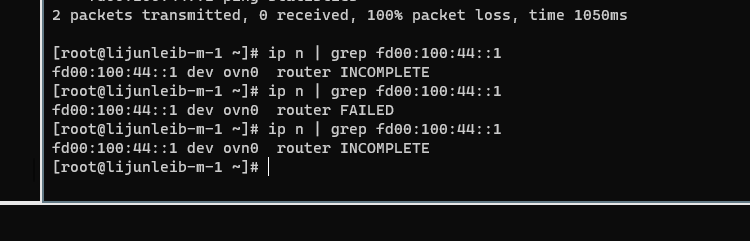
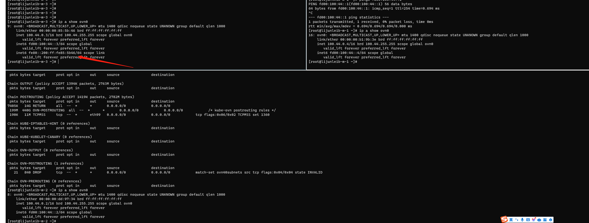
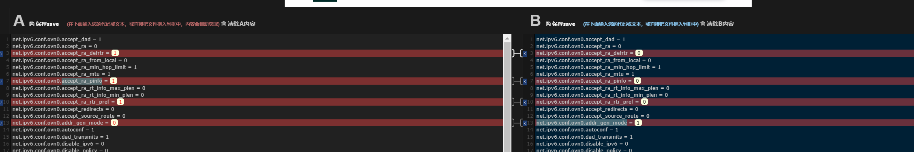
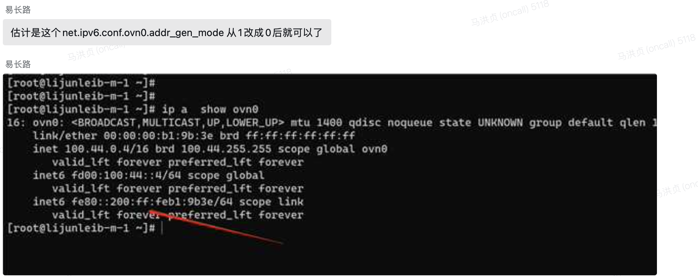
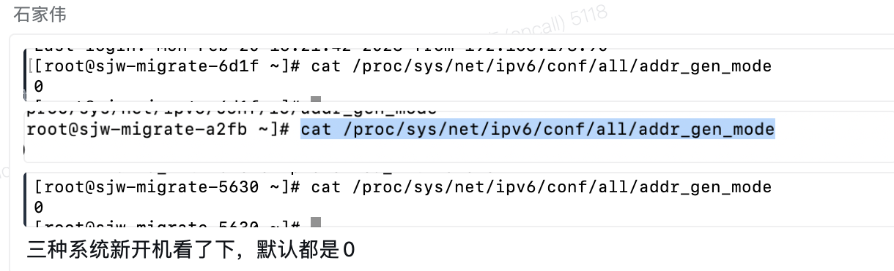
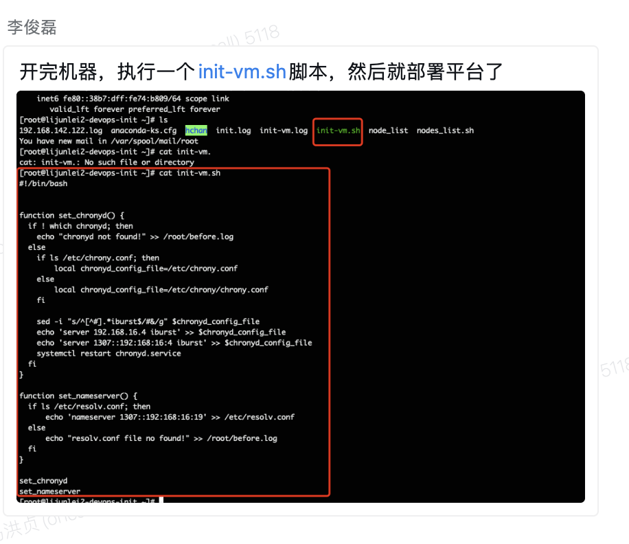

---
kind:
  - Troubleshooting
products:
  - Alauda Container Platform
  - Alauda DevOps
  - Alauda AI
  - Alauda Application Services
  - Alauda Service Mesh
  - Alauda Developer Portal
ProductsVersion:
  - 4.1.0,4.2.x
---
<!-- A type of document that involves encountering a fault, diagnosing it, performing root cause analysis, and providing solutions. -->

# ACP 3.15发版，kube

kube-ovn-cni pod 不断 crash ovn0 网卡 IPv6 地址访问网关不通 异常节点 ovn0 网卡缺少 fe80 IPv6 地址

## Cause
- 异常节点系统参数 net.ipv6.conf.ovn0.addr_gen_mode 值未设置为 0

## Resolution
- 修改异常节点系统参数 net.ipv6.conf.ovn0.addr_gen_mode=0

## [workaround]
- 重建 ovs-ovn pod 可临时恢复，10 分钟后复现

## [Related Information]
**Screenshots**

- Environment: Kylin OS, Kubernetes 双栈环境, kube-ovn v1.12.5
- kube-ovn-cni
- ovn0
- net.ipv6.conf.ovn0.addr_gen_mode
- /var/log/openvswitch
- Component: Kubernetes
- Page ID: 178226121
- Original Title: ACP 3.15发版，kube-ovn-cni 不断 crash
