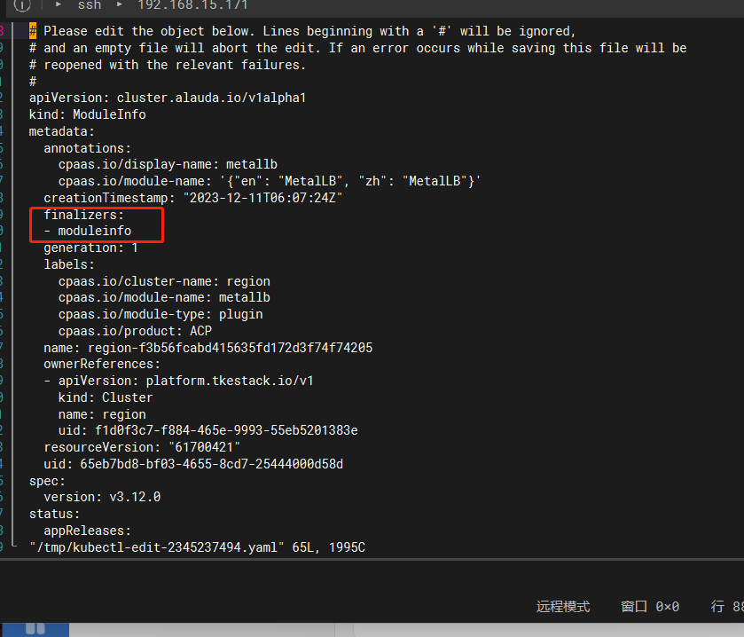
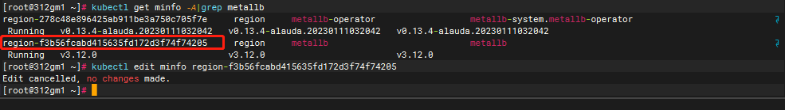
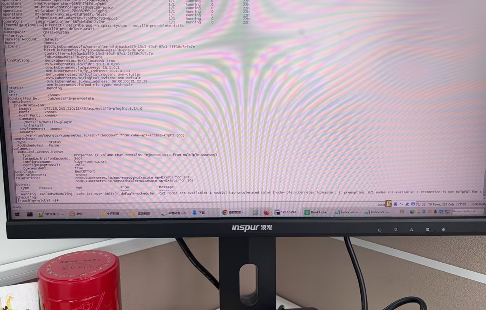

---
kind:
  - Troubleshooting
products:
  - Alauda Container Platform
  - Alauda DevOps
  - Alauda AI
  - Alauda Application Services
  - Alauda Service Mesh
  - Alauda Developer Portal
ProductsVersion:
  - 4.1.0,4.2.x
---
<!-- A type of document that involves encountering a fault, diagnosing it, performing root cause analysis, and providing solutions. -->

# 卸载平台集群插件，卡在卸载中

卸载插件卡在卸载中状态 Job无法创建

## Cause
- minfo资源的finalizers字段阻止删除
- 节点存在污点导致Job无法调度

## Resolution
- kubectl edit minfo 对应插件资源并删除finalizers字段，执行kubectl delete minfo 对应资源
- kubectl taint node <节点> node-role.kubernetes.io/master:NoSchedule- 移除污点

## [workaround]
- 临时移除节点污点，待插件删除完成后重新添加污点

## [Related Information]
**Screenshots**

- minfo资源
- Job
- 节点污点
- node-role.kubernetes.io/master:NoSchedule
- Component: Kubernetes
- Page ID: 178229401
- Original Title: 卸载平台集群插件，卡在卸载中
