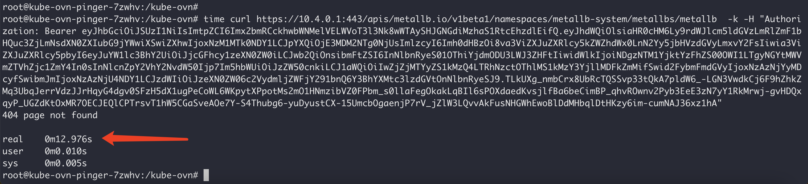
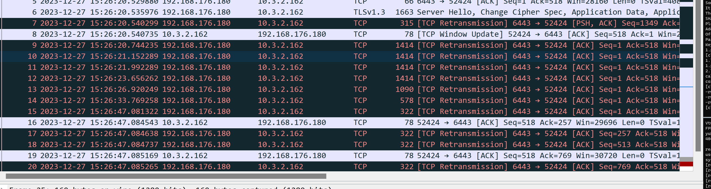
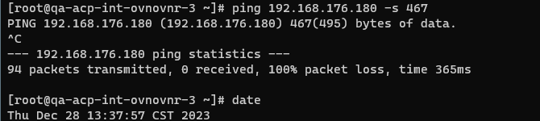
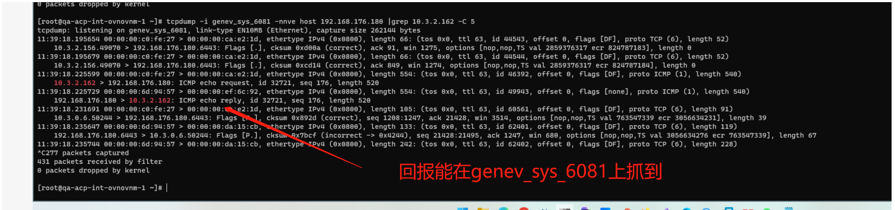
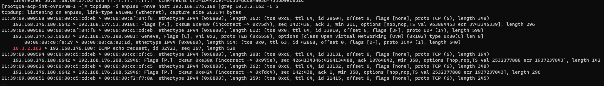
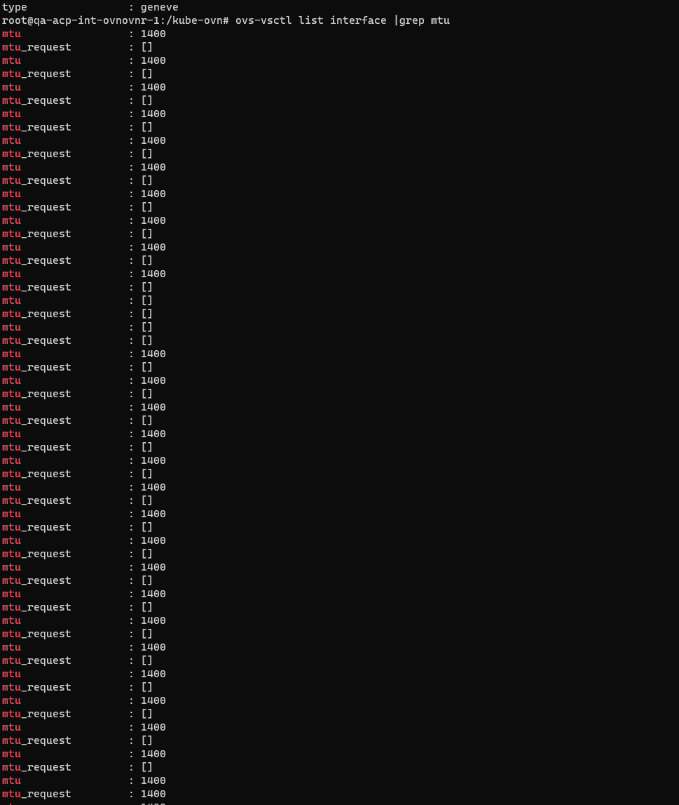
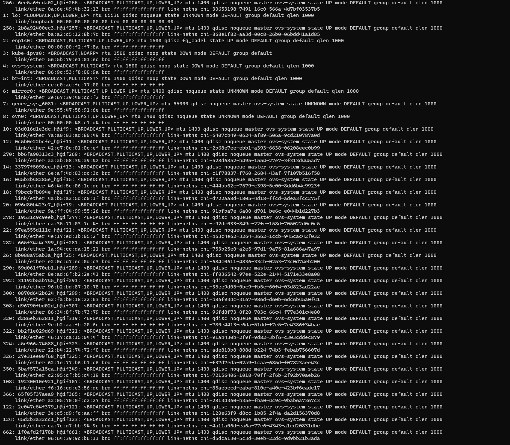
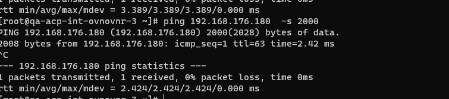
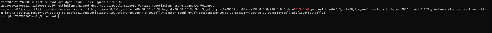

---
kind:
  - Troubleshooting
products:
  - Alauda Container Platform
  - Alauda DevOps
  - Alauda AI
  - Alauda Application Services
  - Alauda Service Mesh
  - Alauda Developer Portal
ProductsVersion:
  - 4.1.0,4.2.x
---
<!-- A type of document that involves encountering a fault, diagnosing it, performing root cause analysis, and providing solutions. -->

# 测试环境出现某些pod访问api

某些pod访问api-server花费时间10~20s TCP重传多次，直到发送长度322的报文才回复 ping节点IP时大包（-s 467）不通，小包（-s 466）可通

## Cause
- net.ipv4.ip_no_pmtu_disc=1导致PMTU发现被禁用
- 大包传输时未正确进行路径MTU发现导致分片失败

## Resolution
- sysctl -w net.ipv4.ip_no_pmtu_disc=0
- 执行ping -c 3 -s 467 -M do {dst-ip}触发PMTU协商

## [workaround]

## [Related Information]
**Screenshots**

- Environment: Linux 4.18.0-80.el8.x86_64, kube-ovn v1.12.5, ACP 3.15.0
- net.ipv4.ip_no_pmtu_disc
- kube-ovn
- geneve网卡
- ovn0接口
- 物理网卡MTU
- Component: Kubernetes
- Page ID: 179603656
- Original Title: 测试环境出现某些pod访问api-server时间过长
