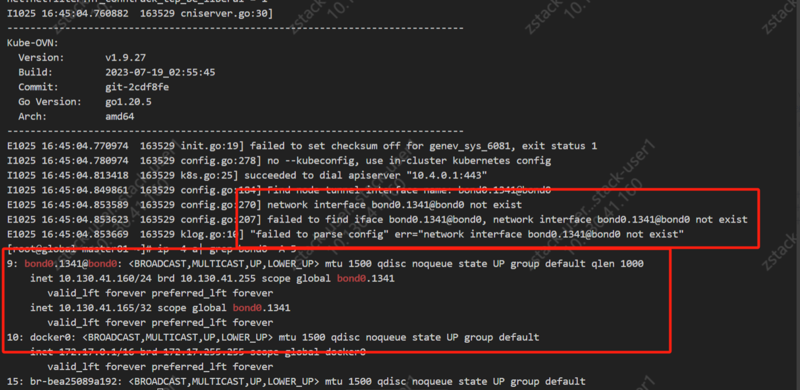
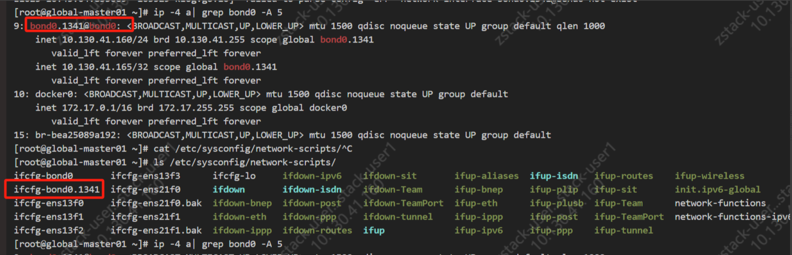
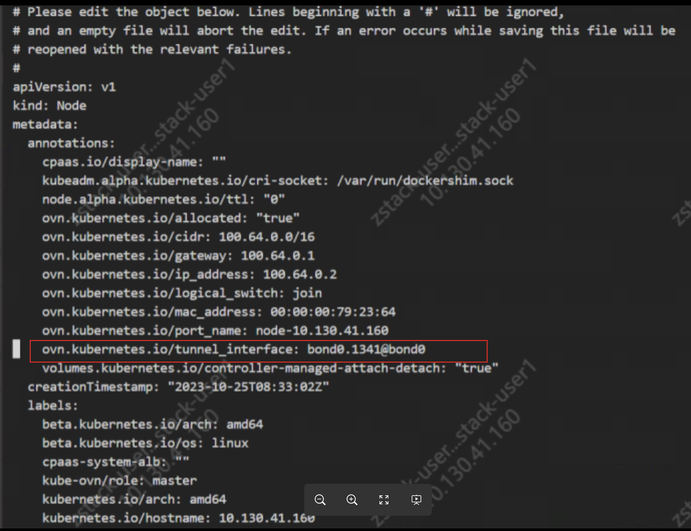

---
kind:
  - Troubleshooting
products:
  - Alauda Container Platform
  - Alauda DevOps
  - Alauda AI
  - Alauda Application Services
  - Alauda Service Mesh
  - Alauda Developer Portal
ProductsVersion:
  - 4.1.0,4.2.x
---
<!-- A type of document that involves encountering a fault, diagnosing it, performing root cause analysis, and providing solutions. -->

# 3.12.2

部署时卡在安装k8s拉取镜像步骤 cni组件无法启动，日志报错failed to find iface bond0.1341@bond0

## Cause
- 部署时填写的网卡名格式不正确（包含@符号）
- kube-ovn-cni从节点annotation中获取的网卡名与真实网卡名不匹配

## Resolution
- 检查节点annotation中的网卡名配置
- 部署时在节点配置界面填写正确的网卡名（如bond0.1341）
- 确保不包含@符号等特殊字符

## [workaround]

## [Related Information]
**Screenshots**

- Environment: 使用OVN网络插件部署平台环境
- kube-ovn-cni
- node annotation
- daemonset配置
- Component: Kubernetes
- Page ID: 179604394
- Original Title: 3.12.2-关于部署平台时的节点网卡名字问题
