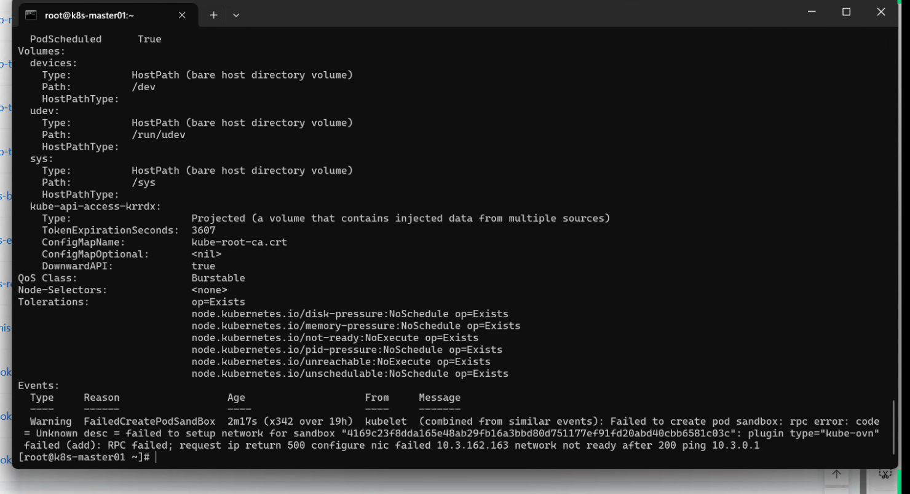
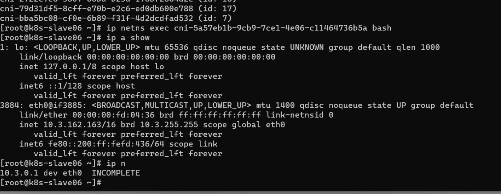
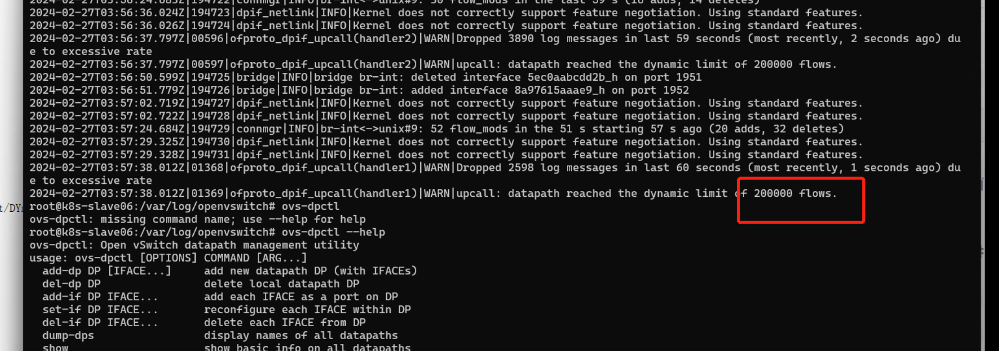
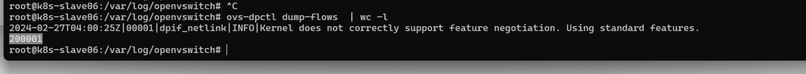

---
kind:
  - Troubleshooting
products:
  - Alauda Container Platform
  - Alauda DevOps
  - Alauda AI
  - Alauda Application Services
  - Alauda Service Mesh
  - Alauda Developer Portal
ProductsVersion:
  - 4.1.0,4.2.x
---
<!-- A type of document that involves encountering a fault, diagnosing it, performing root cause analysis, and providing solutions. -->

# overlay网络pod创建失败network not ready

pod创建失败报错network not ready ping网关10.3.0.1时arp无法获取 ovs-vswitchd.log显示datapath数超过200000条

## Cause
- datapath流表数超过200000条导致资源耗尽

## Resolution
- 进入ovs-ovn pod执行ovs-dpctl del-flows清理datapath流表

## [workaround]

## [Related Information]
**Screenshots**

- Environment: CNI版本：kubeovn:v1.11.12
- ovs-dpctl
- kubectl ko trace
- ovs-vswitchd.log
- datapath flow
- Component: Kubernetes
- Page ID: 194052422
- Original Title: overlay网络pod创建失败network not ready
