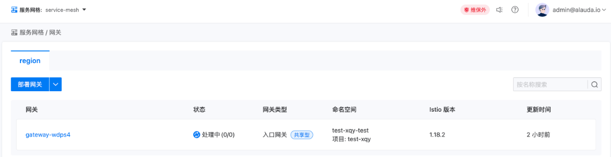
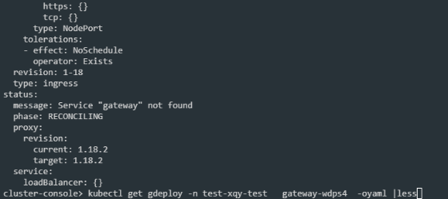

---
kind:
  - Troubleshooting
products:
  - Alauda Container Platform
  - Alauda DevOps
  - Alauda AI
  - Alauda Application Services
  - Alauda Service Mesh
  - Alauda Developer Portal
ProductsVersion:
  - 4.1.0,4.2.x
---
<!-- A type of document that involves encountering a fault, diagnosing it, performing root cause analysis, and providing solutions. -->

# 服务网关

网关状态一直处于处理中 Service "gateway" not found

## Cause
- NodePort主机端口配置为38080，超过k8s默认NodePort范围(30000-32767)

## Resolution
- 重新部署网关并将NodePort主机端口配置为30080

## [workaround]

## [Related Information]
**Screenshots**

- Environment: 3-14-1
- NodePort
- gdeploy
- svc
- 主机端口配置
- Component: Kubernetes
- Page ID: 196904112
- Original Title: 微服务-服务网关-创建服务网关后网关状态一直处于处理中
