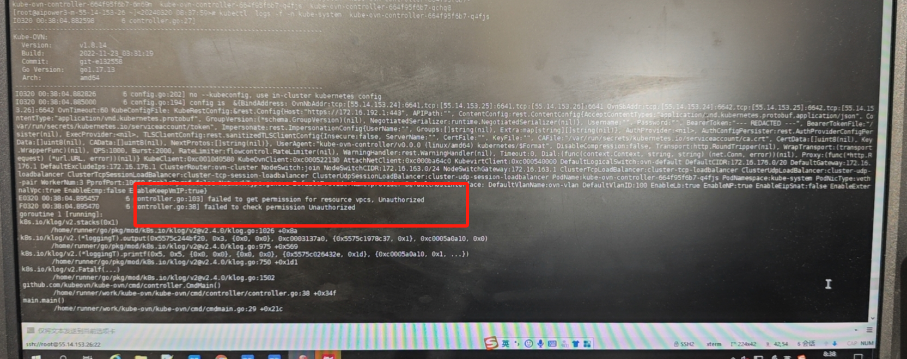
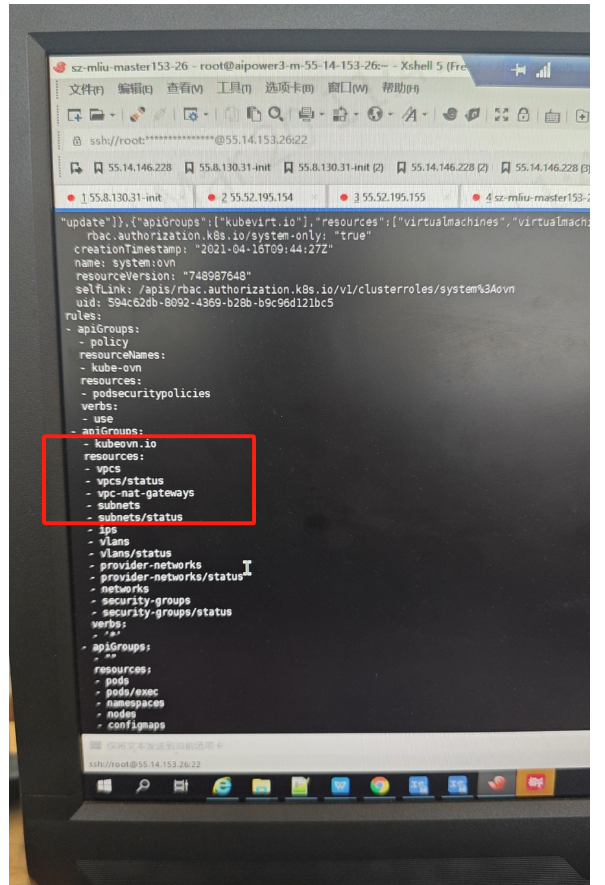
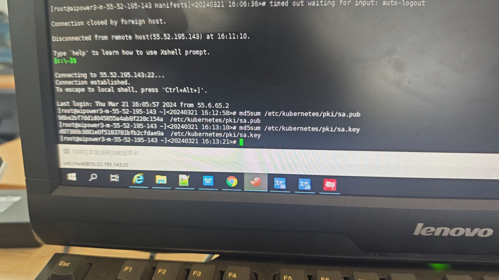
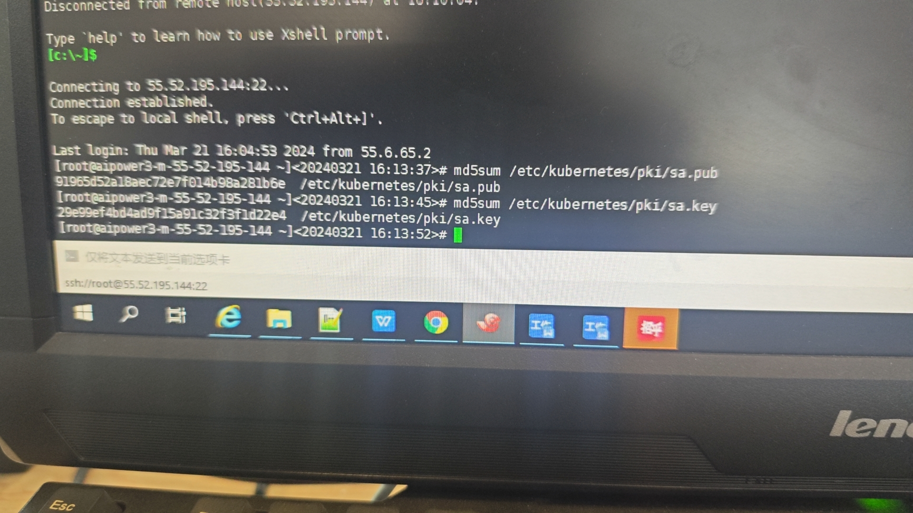

---
kind:
  - Troubleshooting
products:
  - Alauda Container Platform
  - Alauda DevOps
  - Alauda AI
  - Alauda Application Services
  - Alauda Service Mesh
  - Alauda Developer Portal
ProductsVersion:
  - 4.1.0,4.2.x
---
<!-- A type of document that involves encountering a fault, diagnosing it, performing root cause analysis, and providing solutions. -->

# 招商认证问题导致kube

kube-ovn-controller 不断重启 报rbac错误

## Cause
- 新增的master节点与老master节点的sa.pub和sa.key不一致

## Resolution
- 用老master节点的sa.pub和sa.key替换新节点的对应文件
- 重启api-server

## [workaround]

## [Related Information]
**Screenshots**

- sa.pub
- sa.key
- kube-ovn-controller
- api-server
- rbac配置
- Component: Kubernetes
- Page ID: 198254621
- Original Title: 招商认证问题导致kube-ovn-controller起不来
