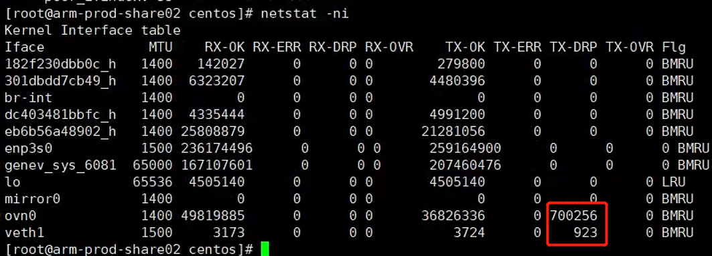
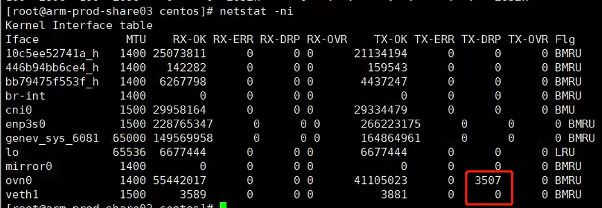
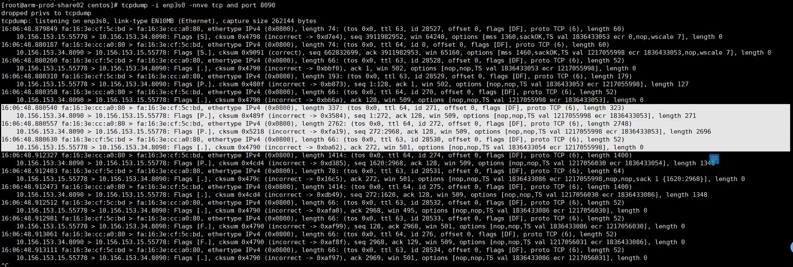
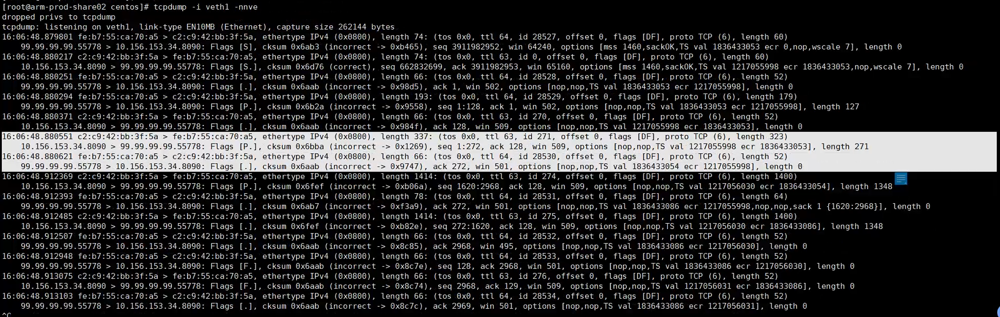
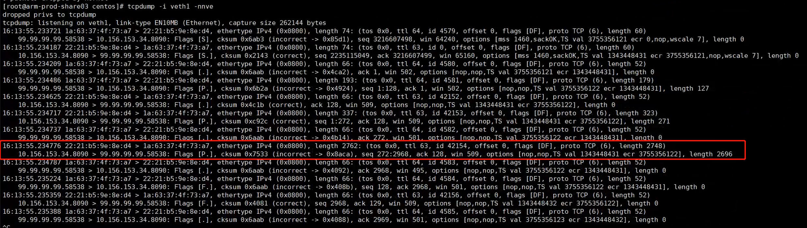

---
kind:
  - Troubleshooting
products:
  - Alauda Container Platform
  - Alauda DevOps
  - Alauda AI
  - Alauda Application Services
  - Alauda Service Mesh
  - Alauda Developer Portal
ProductsVersion:
  - 4.1.0,4.2.x
---
<!-- A type of document that involves encountering a fault, diagnosing it, performing root cause analysis, and providing solutions. -->

# Overlay Pod 下载速度极低

同一集群两个节点上的 Pod 下载集群外文件速度极低（~300 KB/s） 主机下载速度正常（~20 MB/s 或更高） ovn0 到 pod 正常但物理网卡接收包不一致

## Cause

## Resolution
- 重新创建虚拟机并加入集群，移除故障节点

## [workaround]

## [Related Information]
**Screenshots**

- Environment: Kylin V10 SP2 ARM64 | 4.19.90-24.4.v2101.ky10.aarch64 | 虚拟机
- ovn0
- veth1
- iptables TRACE
- sysctl
- netstat -ni
- tcp payload 2696
- Component: Kubernetes
- Page ID: 201459763
- Original Title: Overlay Pod 下载速度极低
