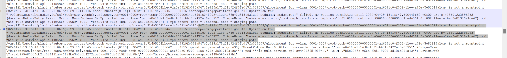

---
kind:
  - Troubleshooting
products:
  - Alauda Container Platform
  - Alauda DevOps
  - Alauda AI
  - Alauda Application Services
  - Alauda Service Mesh
  - Alauda Developer Portal
ProductsVersion:
  - 4.1.0,4.2.x
---
<!-- A type of document that involves encountering a fault, diagnosing it, performing root cause analysis, and providing solutions. -->

# 主机重启后服务pod启动失败

服务pod启动失败 挂载ceph存储失败 存在rpc错误

## Cause
- k8s volumeManager的Bug（k8s v1.27中NewVolumeManagerReconstruction启用且SELinuxMountReadWriteOncePod禁用时，重启node概率触发）

## Resolution
- 修改所有master节点的/etc/kubernetes/manifests/kube-apiserver.yaml文件，新增参数：- --feature-gates=NewVolumeManagerReconstruction=true,SELinuxMountReadWriteOncePod=true
- 升级到k8s v1.27.13及以上版本或平台3.14.3及以上版本

## [workaround]
- 重启kubelet

## [Related Information]
**Screenshots**

- Environment: k8s 1.27.7（平台版本3.14.1）
- kube-apiserver.yaml
- NewVolumeManagerReconstruction
- SELinuxMountReadWriteOncePod
- Component: Kubernetes
- Page ID: 206080951
- Original Title: 主机重启后服务pod启动失败-提供挂载存储问题-提示存在rpc错误
