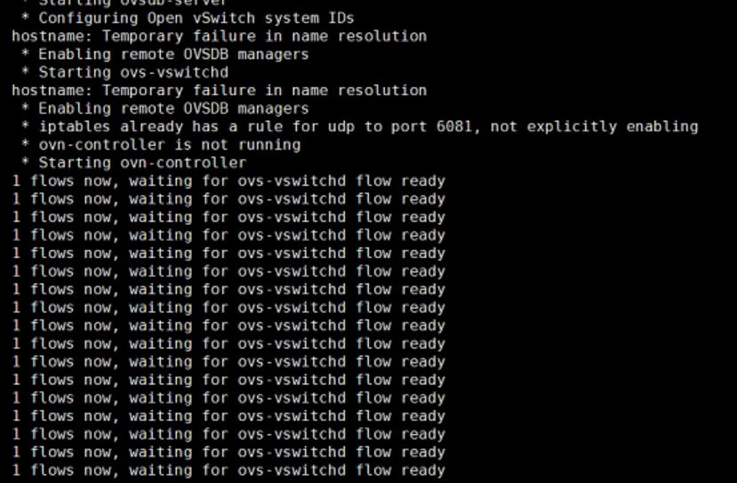

---
kind:
  - Troubleshooting
products:
  - Alauda Container Platform
  - Alauda DevOps
  - Alauda AI
  - Alauda Application Services
  - Alauda Service Mesh
  - Alauda Developer Portal
ProductsVersion:
  - 4.1.0,4.2.x
---
<!-- A type of document that involves encountering a fault, diagnosing it, performing root cause analysis, and providing solutions. -->

# 新加节点 kube

kube-ovn-cni 一直 not ready 日志显示等待 ovn0 gw ready ovs-ovn 日志显示等待 flow ready

## Cause
- 防火墙阻断节点到 OVN SB 的 TCP/6642 端口通信

## Resolution
- 开通节点到 master 的 TCP/6642 端口防火墙规则

## [workaround]

## [Related Information]
**Screenshots**

- Environment: Kube-OVN v1.11
- OVN_SB
- ovn-controller
- kube-ovn-cni
- TCP/6642
- Component: Kubernetes
- Page ID: 207400621
- Original Title: 新加节点 kube-ovn-cni 一直 not ready
