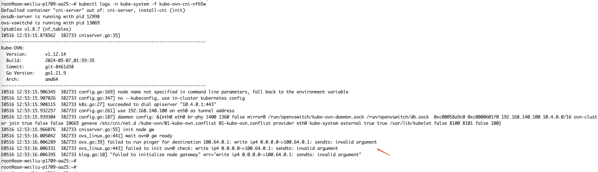
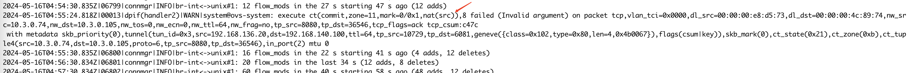
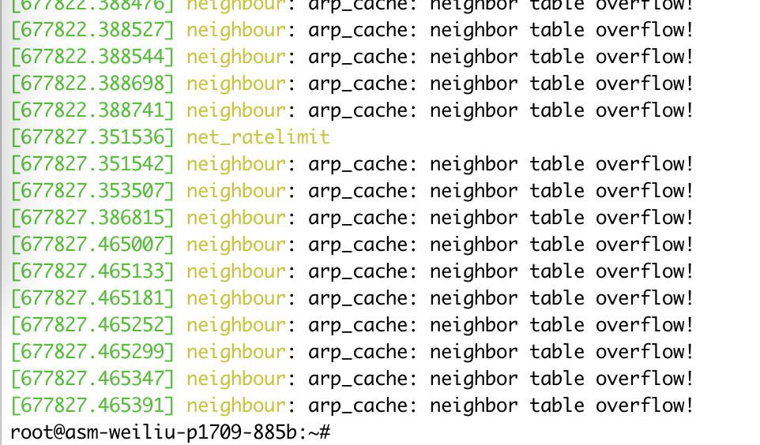
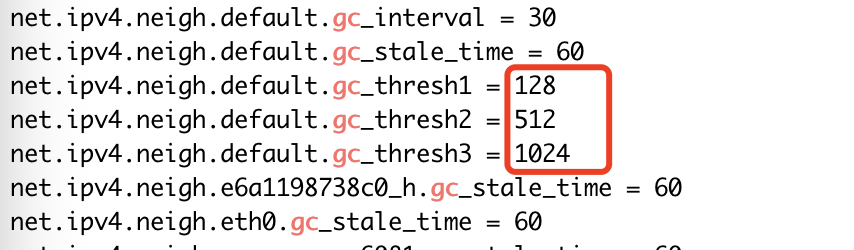

---
kind:
  - Troubleshooting
products:
  - Alauda Container Platform
  - Alauda DevOps
  - Alauda AI
  - Alauda Application Services
  - Alauda Service Mesh
  - Alauda Developer Portal
ProductsVersion:
  - 4.1.0,4.2.x
---
<!-- A type of document that involves encountering a fault, diagnosing it, performing root cause analysis, and providing solutions. -->

# asm 大规模测试环境，arp 表溢出问题

kube-ovn-cni pod 异常崩溃 ovs-vswitchd 日志出现 warn 告警 dmesg 显示 arp 表超限报错

## Cause
- 系统 ARP 表条目超过默认阈值限制

## Resolution
- 增大 /proc/sys/net/ipv4/neigh/default/gc_thresh1
- 增大 /proc/sys/net/ipv4/neigh/default/gc_thresh2
- 增大 /proc/sys/net/ipv4/neigh/default/gc_thresh3

## [workaround]

## [Related Information]
**Screenshots**

- Environment: CNI: kube-ovn v1.12, ACP 3.17 master 版本
- kube-ovn-cni
- ovs-vswitchd
- /proc/sys/net/ipv4/neigh/default/gc_thresh1
- /proc/sys/net/ipv4/neigh/default/gc_thresh2
- /proc/sys/net/ipv4/neigh/default/gc_thresh3
- Component: Kubernetes
- Page ID: 210436448
- Original Title: asm 大规模测试环境，arp 表溢出问题
