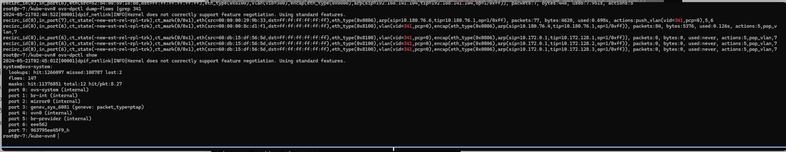
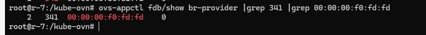
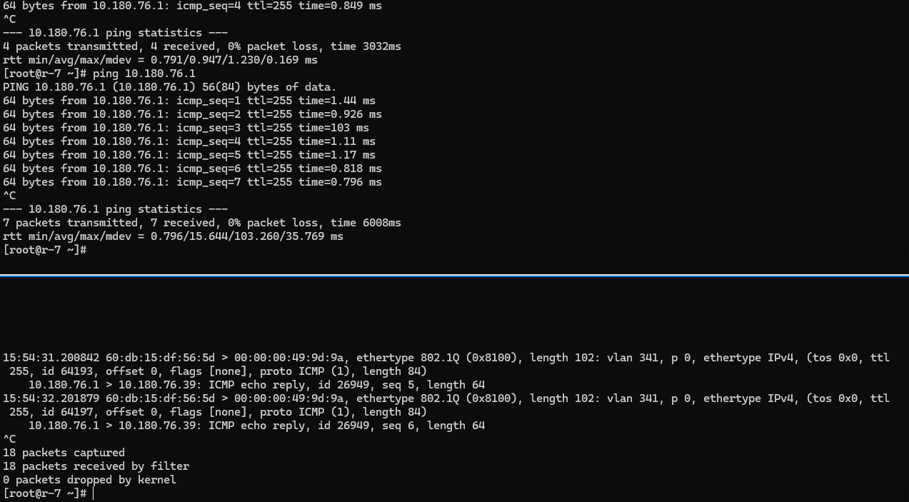
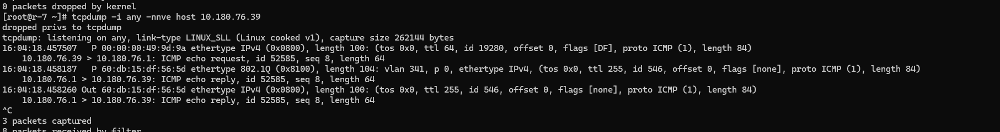
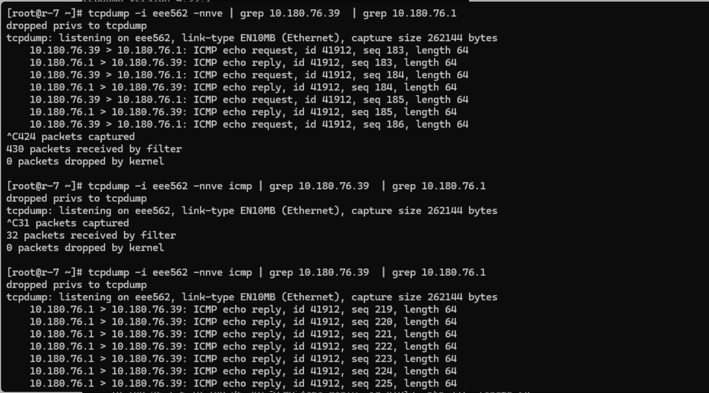
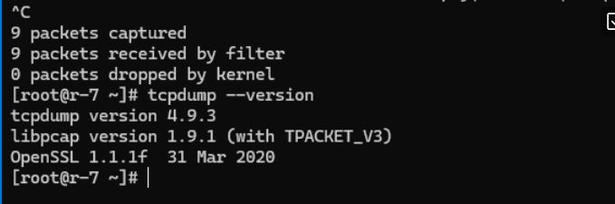

---
kind:
  - Troubleshooting
products:
  - Alauda Container Platform
  - Alauda DevOps
  - Alauda AI
  - Alauda Application Services
  - Alauda Service Mesh
  - Alauda Developer Portal
ProductsVersion:
  - 4.1.0,4.2.x
---
<!-- A type of document that involves encountering a fault, diagnosing it, performing root cause analysis, and providing solutions. -->

# 麒麟环境tcpdump 抓包的bug

underlay pod 启动失败，ping网关不通 tcpdump -i {物理网卡} arp and host {podip} 未抓到arp报文 物理网卡抓包仅能抓到icmp reply报文

## Cause
- 麒麟内核或网卡驱动问题导致流量路径错误
- tcpdump 版本存在icmp协议过滤解析问题

## Resolution
- 迁移虚机到其他物理节点
- 检查交换机/物理环境配置

## [workaround]
- tcpdump抓包时不使用icmp过滤条件
- 使用其他网络调试工具验证流量

## [Related Information]
**Screenshots**

- Environment: Linux r-7 4.19.90-24.4.v2101.ky10.x86_64 #1 SMP Mon May 24 12:14:55 CST 2021 x86_64 x86_64 x86_64 GNU/Linux | kube-ovn v1.12.8
- kube-ovn underlay
- ovn db
- datapath
- fdb
- 物理网卡
- Component: Kubernetes
- Page ID: 210437701
- Original Title: 麒麟环境tcpdump 抓包的bug
