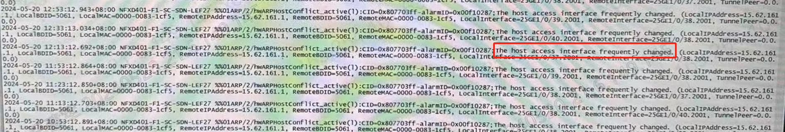
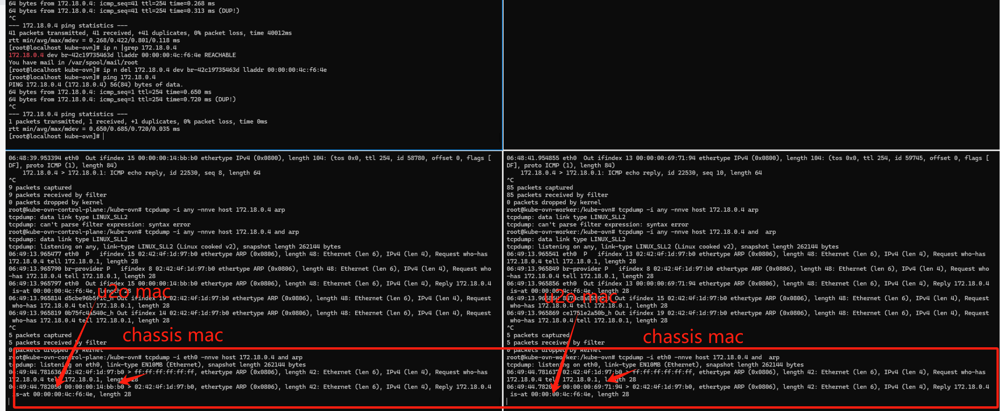
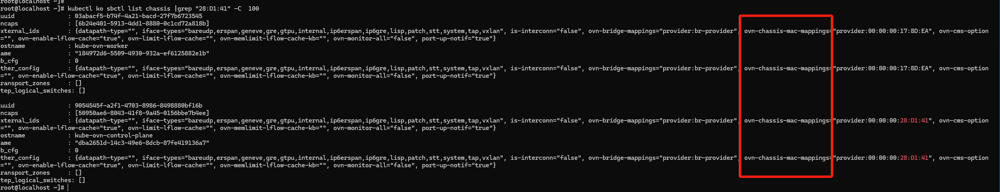
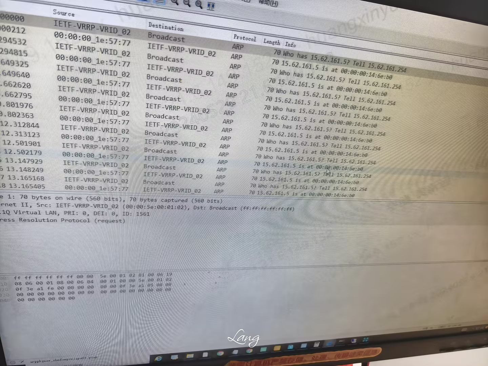
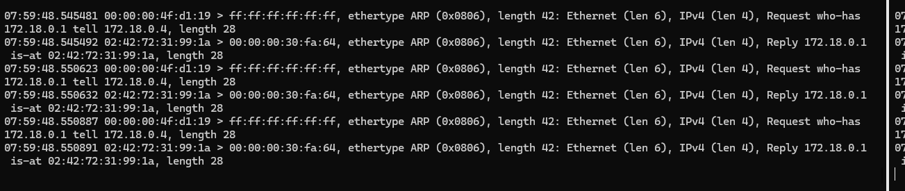
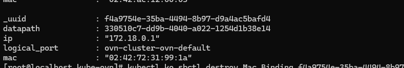

---
kind:
  - Troubleshooting
products:
  - Alauda Container Platform
  - Alauda DevOps
  - Alauda AI
  - Alauda Application Services
  - Alauda Service Mesh
  - Alauda Developer Portal
ProductsVersion:
  - 4.1.0,4.2.x
---
<!-- A type of document that involves encountering a fault, diagnosing it, performing root cause analysis, and providing solutions. -->

# 中信客户交换机上 u2oIP 一直在漂移

交换机持续报警u2oIP漂移 u2oIP的ARP回复报文从不同交换机端口返回 不同节点的ARP回复源MAC地址不一致

## Cause
- 集群外发起u2oIP的ARP请求时所有节点均会响应
- kube-ovn的lrp定期发送ARP请求获取物理网卡MAC地址

## Resolution
- 添加OpenFlow规则丢弃特定ARP请求: ovs-ofctl add-flow {underlay网桥} "priority=10000,in_port=1,arp,arp_spa={物理网关ip},arp_tpa={u2oIP},arp_op=1,actions=drop"

## [workaround]

## [Related Information]
**Screenshots**

- Environment: CNI版本: kube-ovn v1.9.26
- u2oIP
- 物理网关ip
- ovn-chassis-mac-mappings
- kubectl ko nbctl show
- kubectl ko sbctl list chassis
- openflow规则
- Component: Kubernetes
- Page ID: 211783604
- Original Title: 中信客户交换机上 u2oIP 一直在漂移
