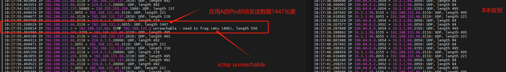

---
kind:
  - Troubleshooting
products:
  - Alauda Container Platform
  - Alauda DevOps
  - Alauda AI
  - Alauda Application Services
  - Alauda Service Mesh
  - Alauda Developer Portal
ProductsVersion:
  - 4.1.0,4.2.x
---
<!-- A type of document that involves encountering a fault, diagnosing it, performing root cause analysis, and providing solutions. -->

# 偶现 UDP 丢包

UDP 丢包 ICMP 'need to frag' 报文

## Cause
- underlay 与 overlay 的 MTU 不一致
- UDP 包大小介于 overlay MTU (1400) 和 underlay MTU (1500) 之间且携带 DF 标记

## Resolution
- 在 underlay pod 添加 init container 执行 `sysctl net.ipv4.ip_no_pmtu_disc=1`

## [workaround]

## [Related Information]
**Screenshots**

- MTU
- sysctl
- metallb vip
- underlay
- overlay
- Component: Kubernetes
- Page ID: 217547305
- Original Title: 偶现 UDP 丢包
