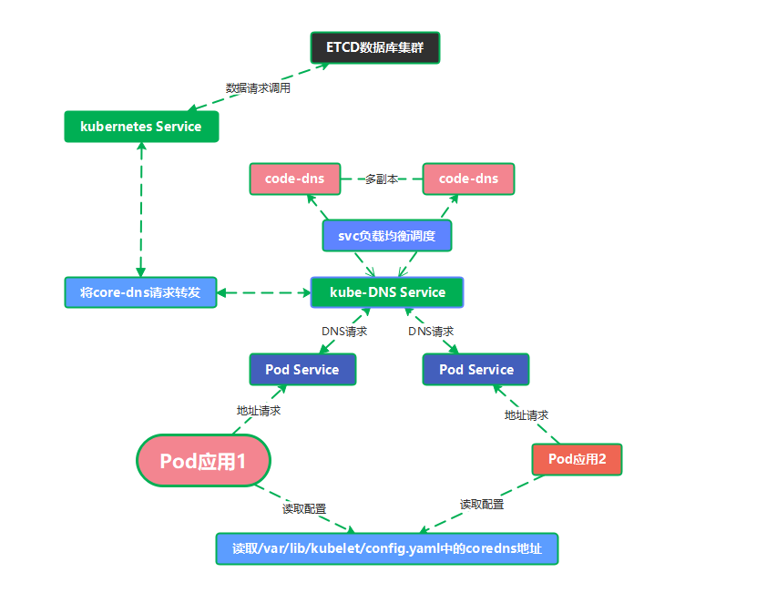

---
kind:
  - Troubleshooting
products:
  - Alauda Container Platform
  - Alauda DevOps
  - Alauda AI
  - Alauda Application Services
  - Alauda Service Mesh
  - Alauda Developer Portal
ProductsVersion:
  - 4.1.0,4.2.x
---
<!-- A type of document that involves encountering a fault, diagnosing it, performing root cause analysis, and providing solutions. -->

# k8s容器内相关域名解析顺序说明

域名解析失败（特别是非.cluster.local后缀的域名） 外部域名解析异常

## Cause
- CoreDNS上游DNS服务器配置错误
- 节点本地/etc/resolv.conf文件配置异常
- forward配置未正确指向有效DNS服务器

## Resolution
- 检查并修改CoreDNS ConfigMap中的forward配置
- 验证节点/etc/resolv.conf文件有效性
- 配置明确的上游DNS服务器地址

## [workaround]
- 在Pod spec中设置dnsConfig覆盖默认配置
- 直接使用完整FQDN（如service.namespace.svc.cluster.local）

## [Related Information]
**Screenshots**

- Environment: Kubernetes集群默认使用CoreDNS作为DNS服务的环境
- /etc/resolv.conf
- kube-dns service
- CoreDNS ConfigMap
- forward参数
- .cluster.local
- Component: Kubernetes
- Page ID: 217547348
- Original Title: k8s容器内相关域名解析顺序说明
