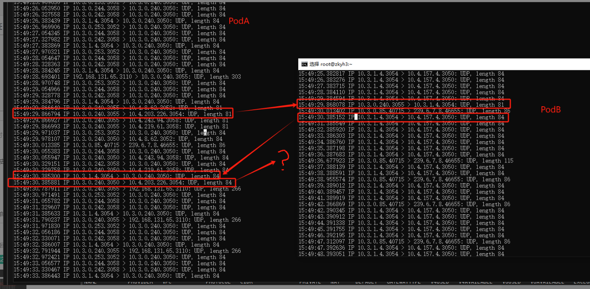
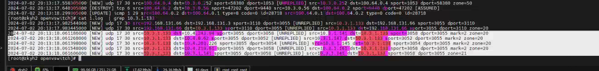

---
kind:
  - Troubleshooting
products:
  - Alauda Container Platform
  - Alauda DevOps
  - Alauda AI
  - Alauda Application Services
  - Alauda Service Mesh
  - Alauda Developer Portal
ProductsVersion:
  - 4.1.0,4.2.x
---
<!-- A type of document that involves encountering a fault, diagnosing it, performing root cause analysis, and providing solutions. -->

# 中科宇航 udp丢包

第三步报文（src port 3050）被丢弃 ovs-vswitchd日志显示conntrack建立失败 conntrack事件中仅第一个报文生成条目

## Cause
- 第三步报文与reply方向的conntrack五元组冲突（src=10.3.0.240:3050, dst=10.3.1.4:3054）
- Kube-OVN的enable-lb功能导致SNAT问题

## Resolution
- 关闭enable-lb功能（但会触发SNAT问题）

## [workaround]

## [Related Information]
**Screenshots**

- Environment: Kubernetes with CNI kube-ovn v1.11.4
- conntrack
- kube-ovn enable-lb配置
- 端口3050/3054/3055
- IP 10.3.0.240/10.4.203.226/10.3.1.4/10.4.157.4
- Component: Kubernetes
- Page ID: 219088984
- Original Title: 中科宇航 udp丢包
