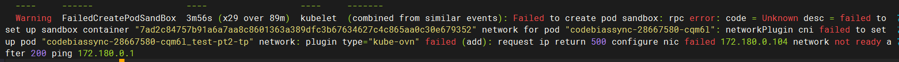
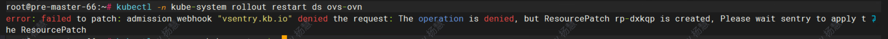
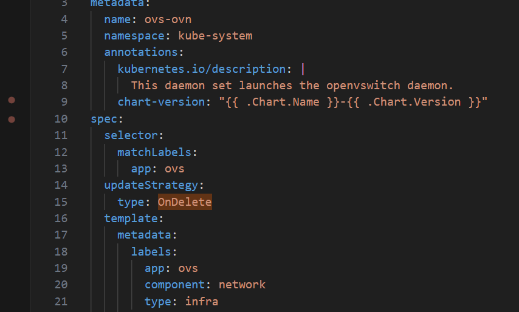

---
kind:
  - Troubleshooting
products:
  - Alauda Container Platform
  - Alauda DevOps
  - Alauda AI
  - Alauda Application Services
  - Alauda Service Mesh
  - Alauda Developer Portal
ProductsVersion:
  - 4.1.0,4.2.x
---
<!-- A type of document that involves encountering a fault, diagnosing it, performing root cause analysis, and providing solutions. -->

# 真点科技在将master 节点迁移到其他master节点后，新增的Pod 启动不了。

新增的Pod启动失败

## Cause
- 迁移master节点后未正确更新ovn nb/sb地址
- kube-ovn的updateStrategy设置为OnDelete导致rollout restart不生效

## Resolution
- 手动删除ovs-ovn pod触发更新

## [workaround]

## [Related Information]
**Screenshots**

- Environment: CNI版本：kube-ovn 1.9.27
- ovs-ovn pod
- kube-ovn 1.9
- kube-ovn 1.11
- updateStrategy配置
- Component: Kubernetes
- Page ID: 219090303
- Original Title: 真点科技在将master 节点迁移到其他master节点后，新增的Pod 启动不了。
