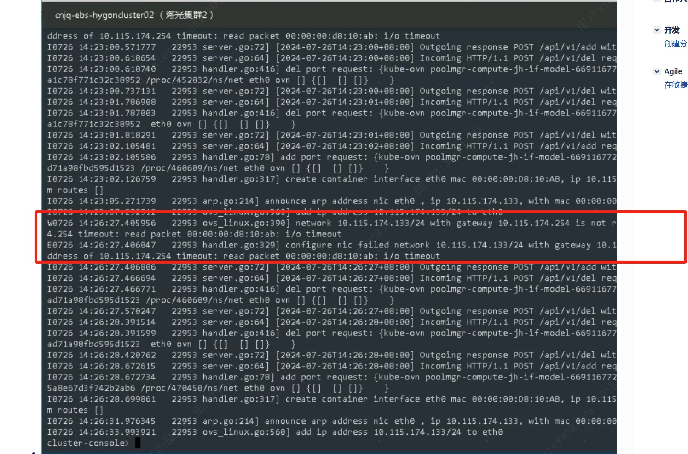

---
kind:
  - Troubleshooting
products:
  - Alauda Container Platform
  - Alauda DevOps
  - Alauda AI
  - Alauda Application Services
  - Alauda Service Mesh
  - Alauda Developer Portal
ProductsVersion:
  - 4.1.0,4.2.x
---
<!-- A type of document that involves encountering a fault, diagnosing it, performing root cause analysis, and providing solutions. -->

# underlay 环境Pod 创建失败

Pod 起不来报到达网关不通

## Cause
- ovs 表项异常
- ovs-appctl fdb/show 显示流表缺失
- ovs-ovn 组件状态异常

## Resolution
- 重启 ovs-ovn pod

## [workaround]

## [Related Information]
**Screenshots**

- Environment: 操作系统：, 内核：, Kubernetes 版本：, CNI 版本：, acp 版本3.14.2
- ovs-vswitch
- ovn-controller
- ovs-appctl fdb/show
- Component: Kubernetes
- Page ID: 224657598
- Original Title: underlay 环境Pod 创建失败
