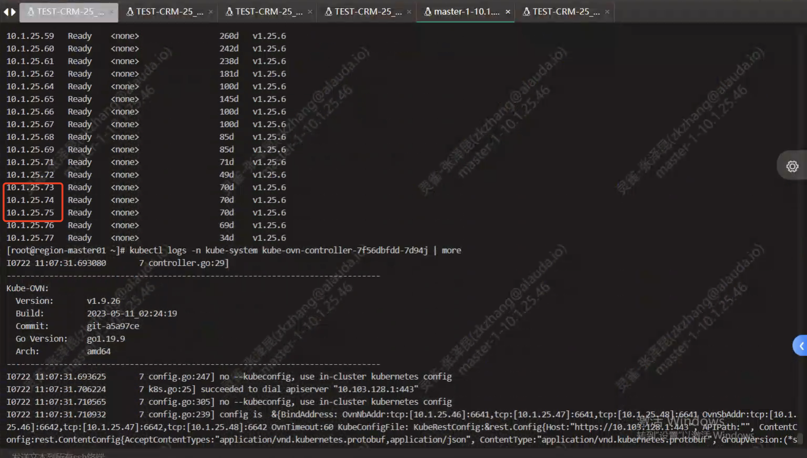
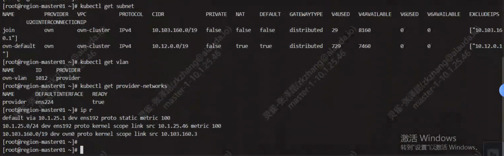
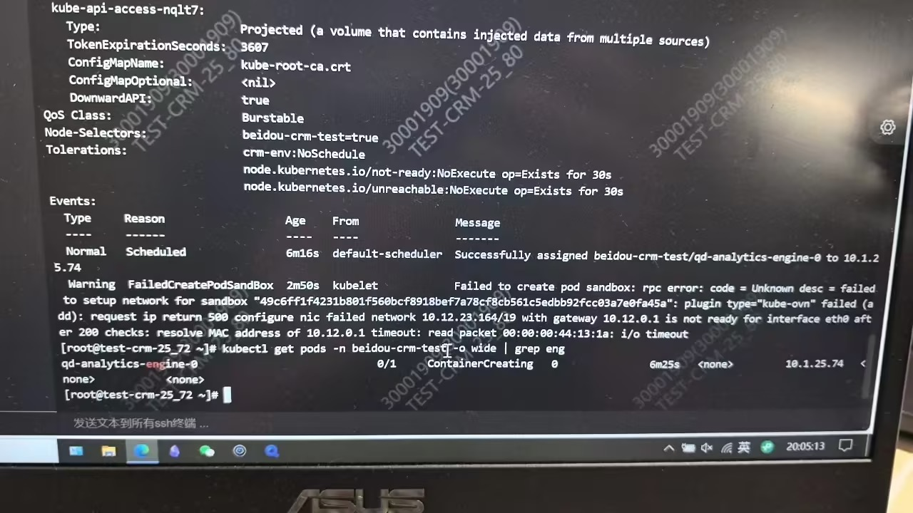
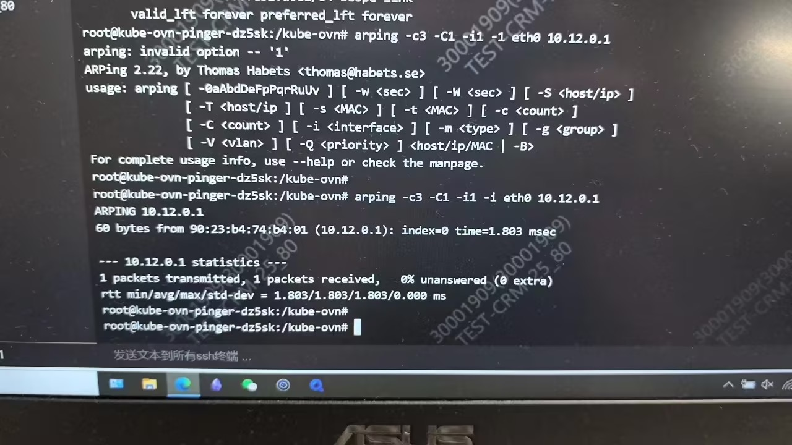
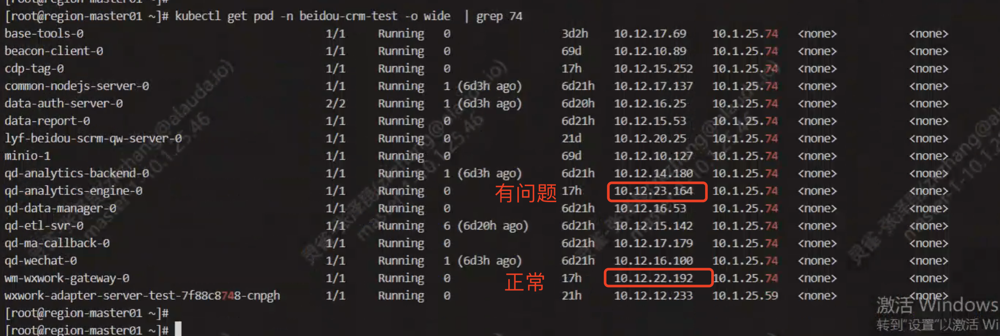
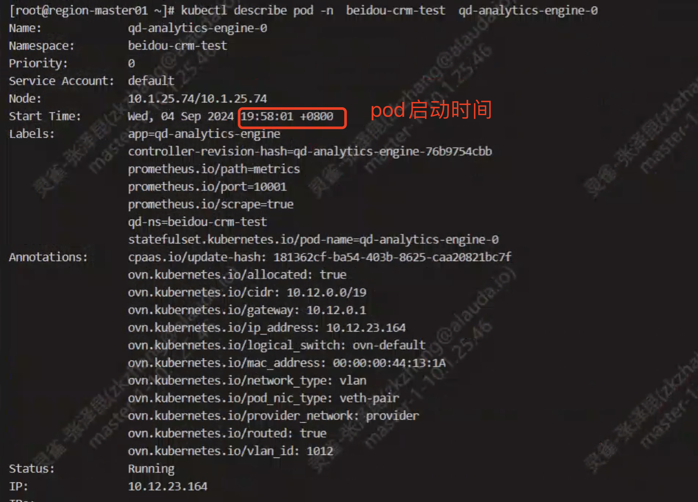
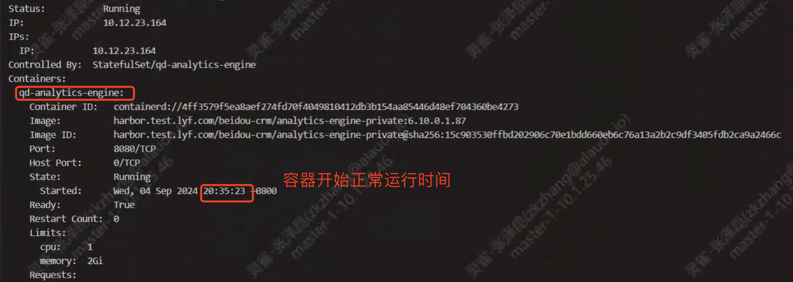
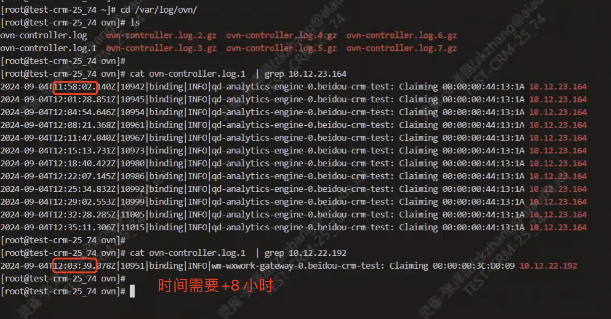
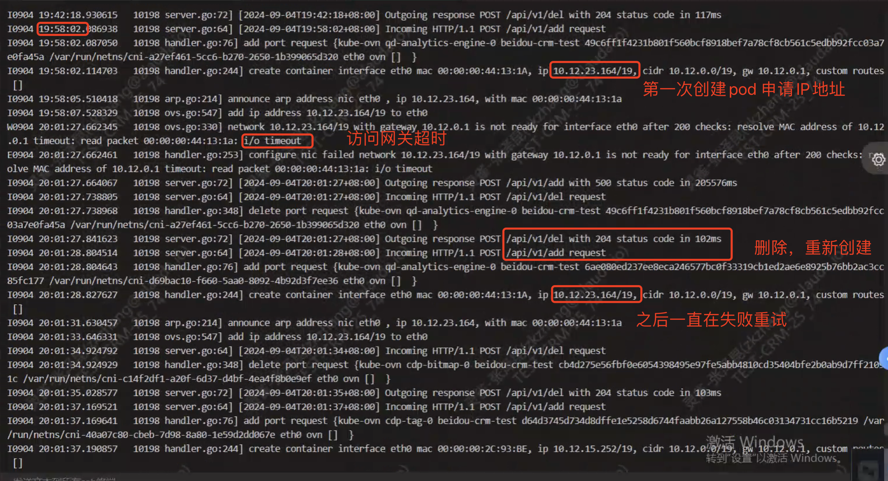
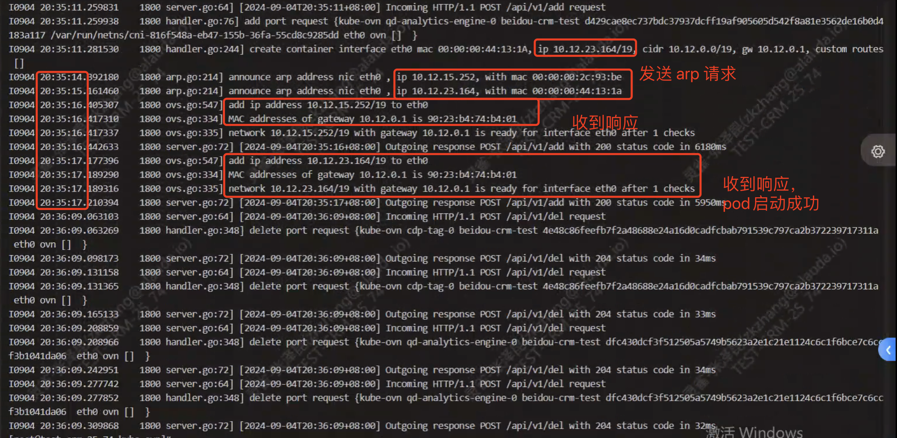

---
kind:
  - Troubleshooting
products:
  - Alauda Container Platform
  - Alauda DevOps
  - Alauda AI
  - Alauda Application Services
  - Alauda Service Mesh
  - Alauda Developer Portal
ProductsVersion:
  - 4.1.0,4.2.x
---
<!-- A type of document that involves encountering a fault, diagnosing it, performing root cause analysis, and providing solutions. -->

# 来伊份_underlay环境，pod 创建耗时特别长

pod 创建耗时特别长（约37分钟） 网关未响应ARP请求导致超时重建 相同时间重启的pod中部分启动正常，部分耗时异常

## Cause
- pod发送ARP请求到网关未获得响应

## Resolution
- 联系客户IAAS团队检查网关配置

## [workaround]

## [Related Information]
**Screenshots**

- Environment: CNI版本：kube-ovn 1.9.27 | ACP 3.12.1
- kube-ovn-cni
- ovn-controller
- arping -c3 -C1 -i1 -I $nicName $gateway
- 网关配置
- Component: Kubernetes
- Page ID: 231116173
- Original Title: 来伊份_underlay环境，pod 创建耗时特别长
