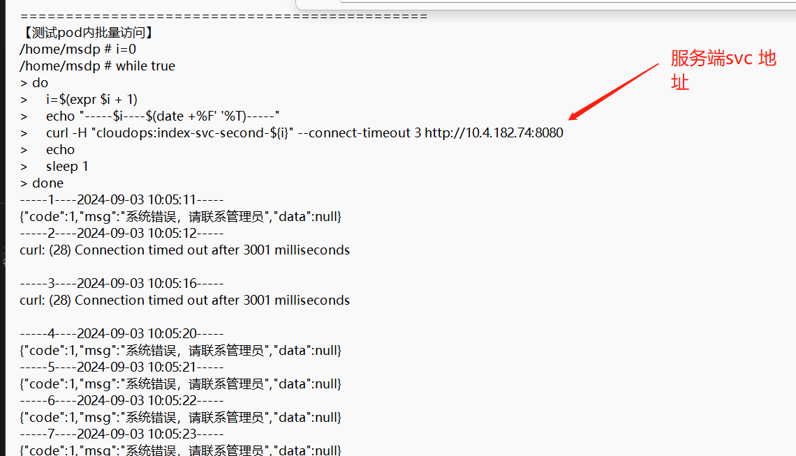
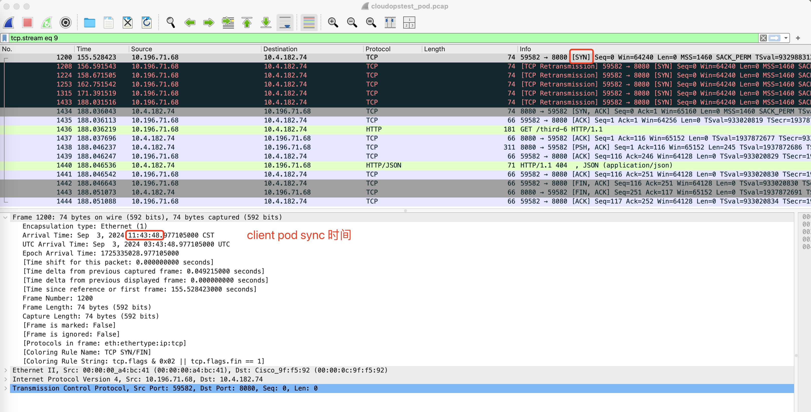
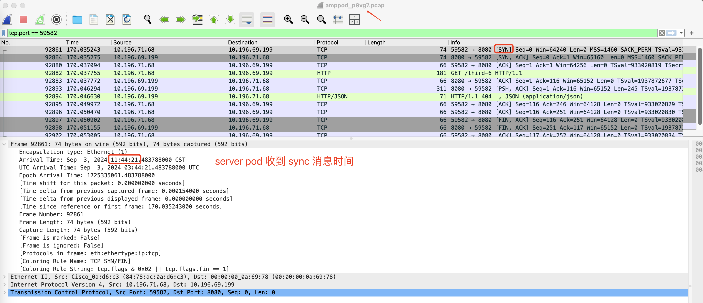
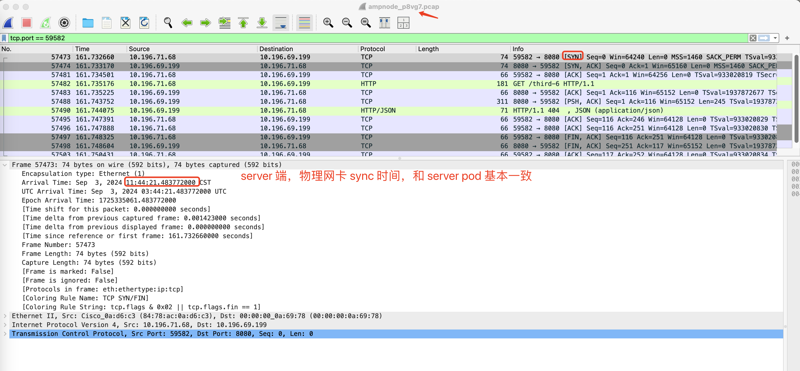
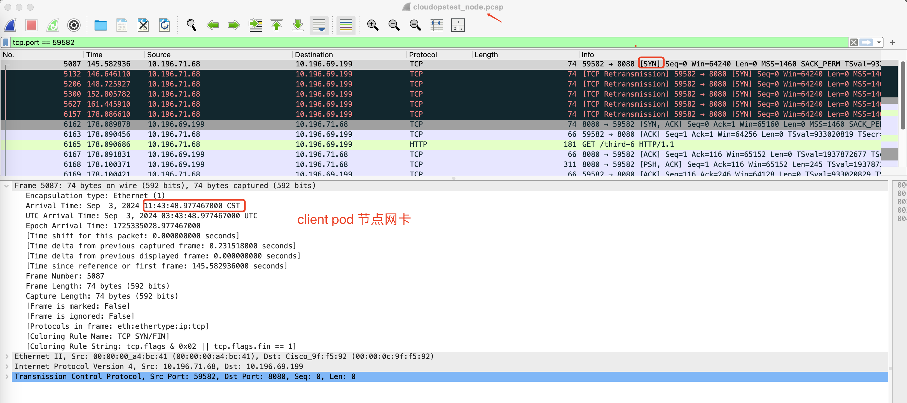

---
kind:
  - Troubleshooting
products:
  - Alauda Container Platform
  - Alauda DevOps
  - Alauda AI
  - Alauda Application Services
  - Alauda Service Mesh
  - Alauda Developer Portal
ProductsVersion:
  - 4.1.0,4.2.x
---
<!-- A type of document that involves encountering a fault, diagnosing it, performing root cause analysis, and providing solutions. -->

# 郑州银行，应用访问svc ip+port连接超时，同时解析svc地址解析会失败

应用pod解析跨ns的svc存在解析失败 应用pod直接访问svc ip+port存在连接超时 去掉超时限制后请求耗时30秒以上

## Cause
- 报文在网关转发到对端pod存在延迟

## Resolution
- 协调iaas团队进行底层网络排查

## [workaround]

## [Related Information]
**Screenshots**

- Environment: Kubernetes with kube-ovn underlay CNI, ACP 3.12.3
- kube-ovn
- svc ip
- port
- ACP 3.12.3
- Component: Kubernetes
- Page ID: 231116351
- Original Title: 郑州银行，应用访问svc ip+port连接超时，同时解析svc地址解析会失败
