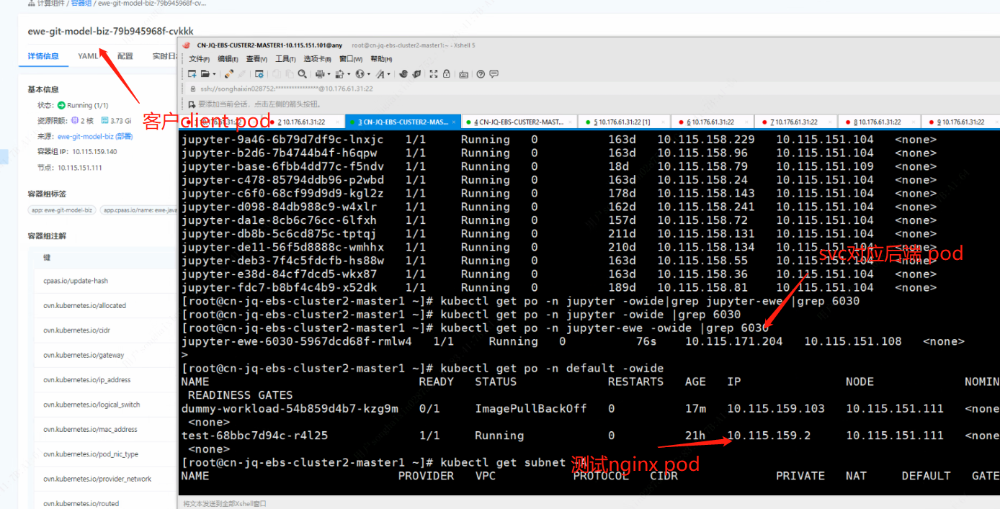
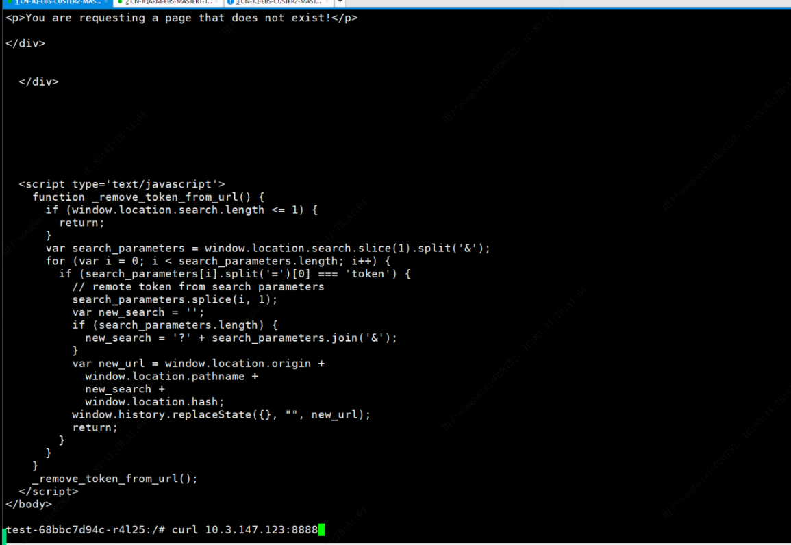
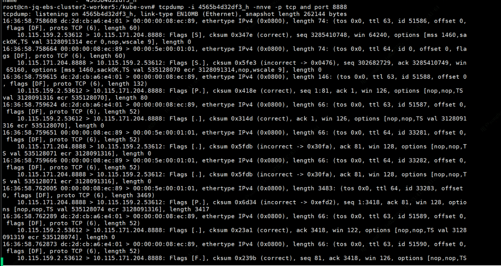
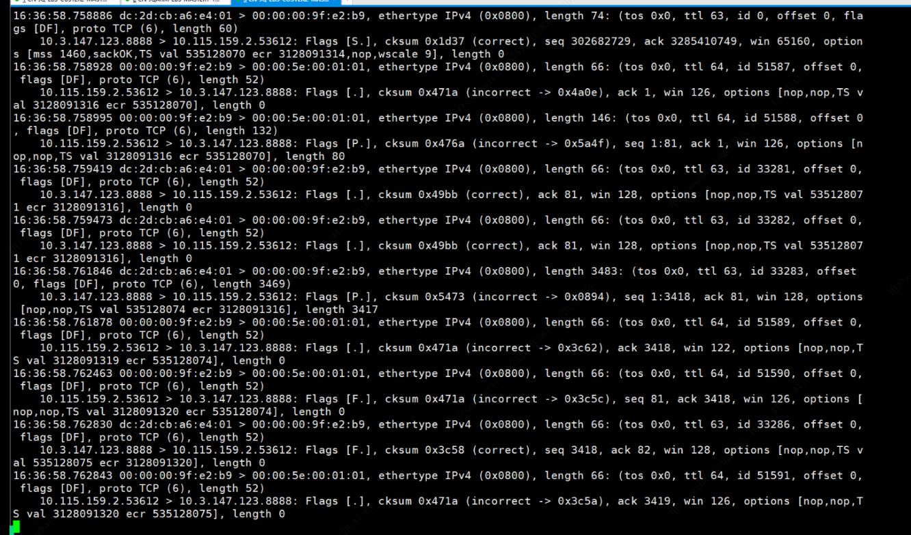
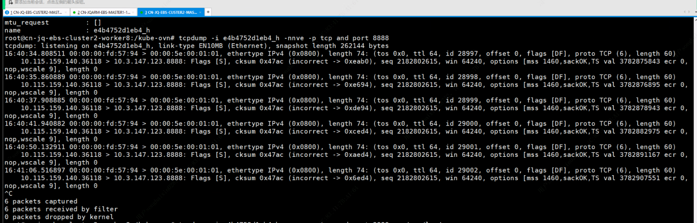

---
kind:
  - Troubleshooting
products:
  - Alauda Container Platform
  - Alauda DevOps
  - Alauda AI
  - Alauda Application Services
  - Alauda Service Mesh
  - Alauda Developer Portal
ProductsVersion:
  - 4.1.0,4.2.x
---
<!-- A type of document that involves encountering a fault, diagnosing it, performing root cause analysis, and providing solutions. -->

# 国泰君安，集群内两个节点上的某一个应用无法访问内部的svc

跨节点访问svc不通 仅特定节点上的client pod访问特定server pod时异常 报文在server节点underlay网卡未捕获

## Cause
- underlay网络层报文转发异常

## Resolution
- 联系iaas团队排查网络报文转发问题

## [workaround]
- 创建测试pod/svc延长故障排查时间窗口

## [Related Information]
**Screenshots**

- Environment: CNI版本：kube-ovn underlay环境，ACP 3.14.2
- kube-ovn
- underlay网络
- svc配置
- pod子网分配
- Component: Kubernetes
- Page ID: 231116371
- Original Title: 国泰君安，集群内两个节点上的某一个应用无法访问内部的svc
