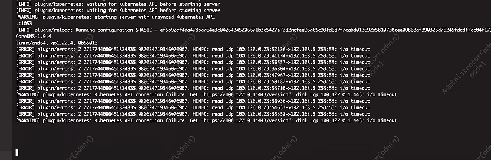

---
kind:
  - Troubleshooting
products:
  - Alauda Container Platform
  - Alauda DevOps
  - Alauda AI
  - Alauda Application Services
  - Alauda Service Mesh
  - Alauda Developer Portal
ProductsVersion:
  - 4.1.0,4.2.x
---
<!-- A type of document that involves encountering a fault, diagnosing it, performing root cause analysis, and providing solutions. -->

# v3.12

平台部署卡在安装k8s阶段 coredns无法正常运行 coredns日志显示DNS解析超时

## Cause
- openEuler操作系统中未设置net.ipv4.conf.lxc*.rp_filter = 0参数导致网络过滤异常

## Resolution
- 修改/etc/sysctl.d/99-sysctl.conf文件添加net.ipv4.conf.lxc*.rp_filter = 0
- 重启主机使配置生效

## [workaround]

## [Related Information]
**Screenshots**

- Environment: openEuler操作系统 v3.12.1
- coredns
- sysctl.conf
- net.ipv4.conf.lxc*.rp_filter
- lxc网络接口
- Component: Kubernetes
- Page ID: 233866455
- Original Title: v3.12-基础架构-平台部署卡在安装k8s阶段
