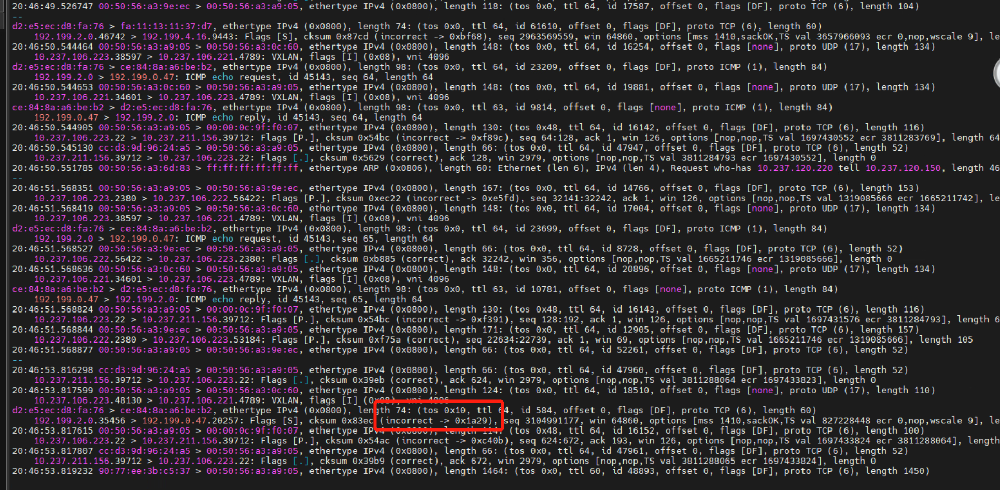

---
kind:
  - Troubleshooting
products:
  - Alauda Container Platform
  - Alauda DevOps
  - Alauda AI
  - Alauda Application Services
  - Alauda Service Mesh
  - Alauda Developer Portal
ProductsVersion:
  - 4.1.0,4.2.x
---
<!-- A type of document that involves encountering a fault, diagnosing it, performing root cause analysis, and providing solutions. -->

# 中信建投 Flannel 替换一个global master节点后，新节点到其他节点pod网络不通

新节点到其他节点pod网络不通（能ping通，但telnet/curl不通） 发送端物理网卡出现checksum incorrect报文

## Cause
- 物理网卡启用了tx checksum offload导致报文校验和错误

## Resolution
- 关闭新节点物理网卡的tx checksum offload：ethtool -K ens192 tx off

## [workaround]

## [Related Information]
**Screenshots**

- Environment: ACP 3.12.1, Flannel
- Component: Kubernetes
- Page ID: 234979817
- Original Title: 中信建投 Flannel 替换一个global master节点后，新节点到其他节点pod网络不通
