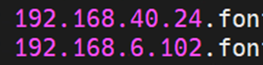
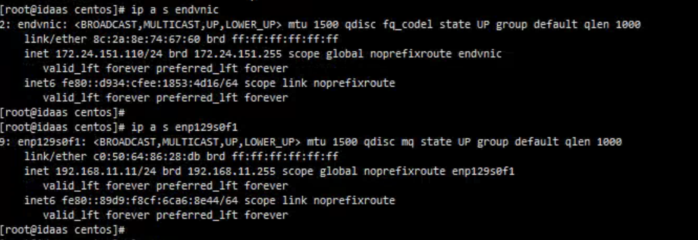
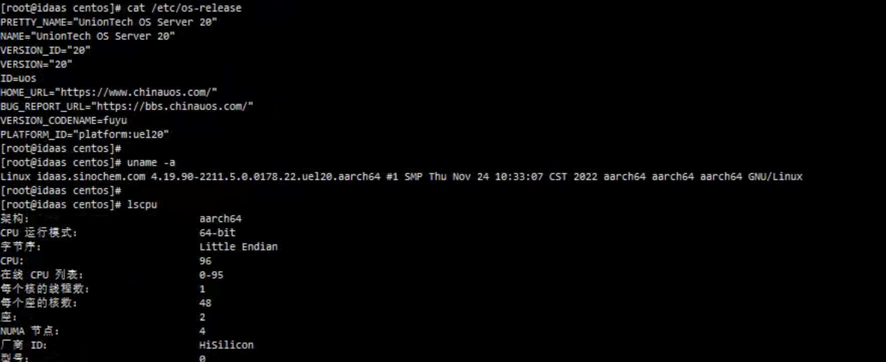
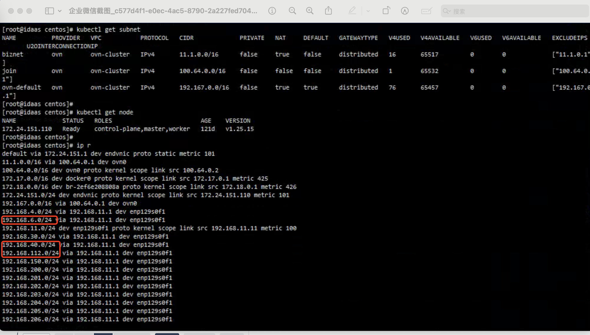
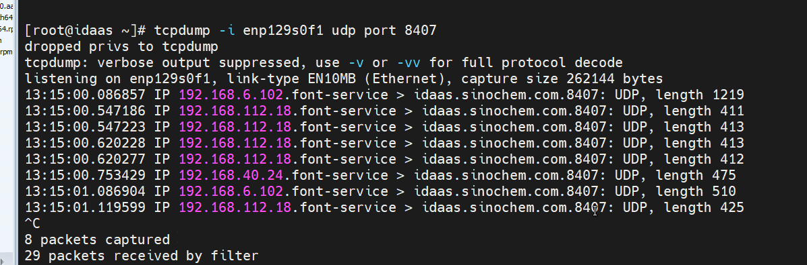
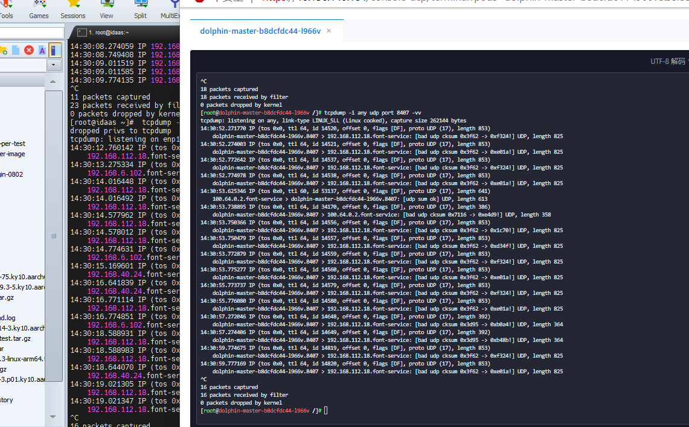
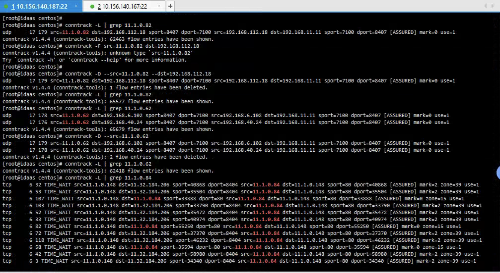

---
kind:
  - Troubleshooting
products:
  - Alauda Container Platform
  - Alauda DevOps
  - Alauda AI
  - Alauda Application Services
  - Alauda Service Mesh
  - Alauda Developer Portal
ProductsVersion:
  - 4.1.0,4.2.x
---
<!-- A type of document that involves encountering a fault, diagnosing it, performing root cause analysis, and providing solutions. -->

# 中化信息，UOS 系统，集群外访问 pod 失败

192.168.40.** 和192.168.6.** 网段访问 NodePort 服务异常 容器内部抓包未发现目标网段流量 conntrack 记录中存在指向旧 Pod IP(11.1.0.62/82)的条目

## Cause
- UOS 系统 conntrack 表项未及时更新，残留旧 Pod IP 映射关系

## Resolution
- 清理异常 conntrack 记录: conntrack -D 命令删除旧条目

## [workaround]

## [Related Information]
**Screenshots**
****

- Environment: UOS 系统, kube-ovn v1.11.12, ACP 3.14.1
- NodePort:8407/udp
- kube-ovn
- conntrack
- svc/endpoints
- ovn0 网卡
- Component: Kubernetes
- Page ID: 234983002
- Original Title: 中化信息，UOS 系统，集群外访问 pod 失败
