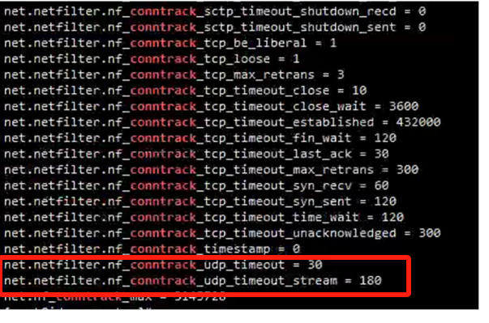

---
kind:
  - Troubleshooting
products:
  - Alauda Container Platform
  - Alauda DevOps
  - Alauda AI
  - Alauda Application Services
  - Alauda Service Mesh
  - Alauda Developer Portal
ProductsVersion:
  - 4.1.0,4.2.x
---
<!-- A type of document that involves encountering a fault, diagnosing it, performing root cause analysis, and providing solutions. -->

# ovn

UDP协议的数据包无法通过NodePort服务发送到Pod中 物理网卡和ovn0虚拟网卡能抓到192.168.40和192.168.6网段的数据包 容器内部抓不到192.168.40和192.168.6网段的数据包

## Cause
- 主机conntrack表残留已删除Pod的IP记录(11.1.0.82/11.1.0.62)
- 操作系统未及时清理失效的conntrack条目

## Resolution
- conntrack -L |grep 问题IP
- conntrack -D - src=问题IP

## [workaround]

## [Related Information]
**Screenshots**

- Environment: KubeSphere 3.14.*, OVN 1.11.12 overlay模式, 统信OS 4.19.90-2211.5.0.0178.22.uel20.aarch64内核
- conntrack
- NodePort
- UDP 8407
- PodIP
- ovn-overlay
- Component: Kubernetes
- Page ID: 237535464
- Original Title: ovn-overlay模式-nodeport暴露-udp协议的数据包无法通过svc发送到pod中
