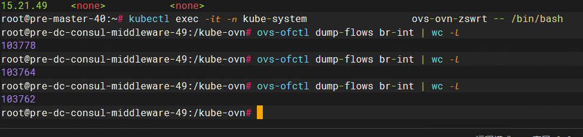
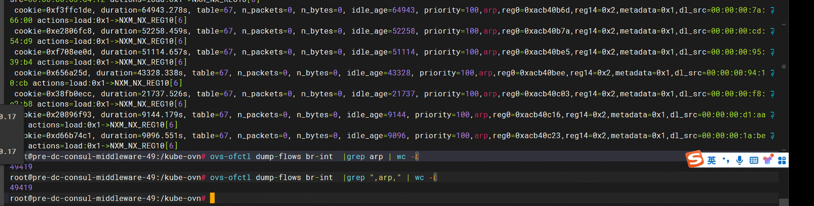
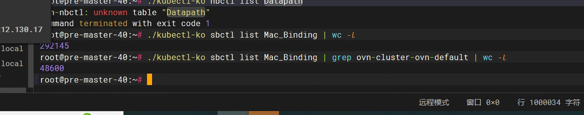
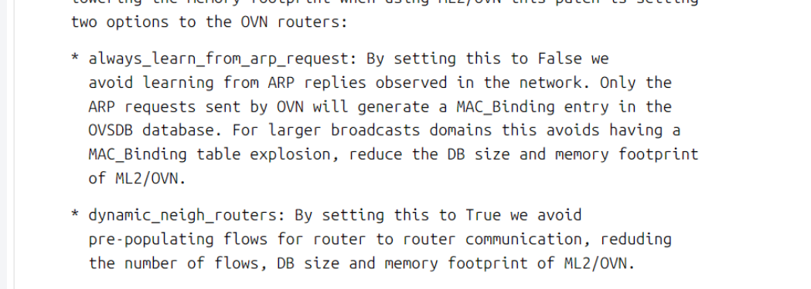
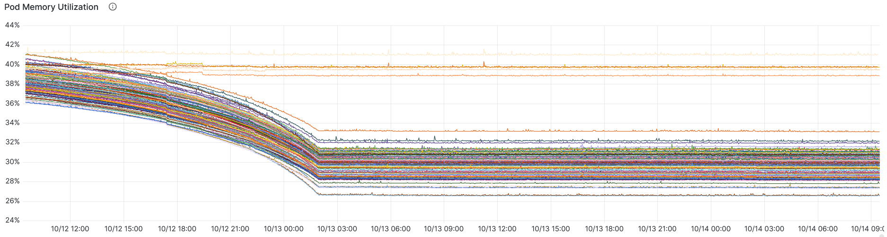
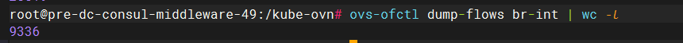

---
kind:
  - Troubleshooting
products:
  - Alauda Container Platform
  - Alauda DevOps
  - Alauda AI
  - Alauda Application Services
  - Alauda Service Mesh
  - Alauda Developer Portal
ProductsVersion:
  - 4.1.0,4.2.x
---
<!-- A type of document that involves encountering a fault, diagnosing it, performing root cause analysis, and providing solutions. -->

# ovs

ovs-ovn pod 内存占用偏高 网络性能下降丢包 流表数量过高（10w+）

## Cause
- Service 后端 Pod 重建后遗留垃圾 Mac_Binding 表项
- 每个 Mac_Binding 表项生成 2 条 openflow 流表
- kube-ovn 1.9.27 版本缺乏自动清理机制

## Resolution
- kubectl ko nbctl set logical_router ovn-cluster options:always_learn_from_arp_request=false
- kubectl ko nbctl set logical_router ovn-cluster options:dynamic_neigh_routers=true
- 使用 delete-mac-binding.sh 脚本清理历史表项
- 重启 ovs-ovn pod

## [workaround]
- 手动执行清理脚本: ./delete-mac-binding.sh "10.16."

## [Related Information]
**Screenshots**

- Environment: CNI 版本: 1.9.27
- logical_router ovn-cluster
- options:always_learn_from_arp_request
- options:dynamic_neigh_routers
- options:mac_binding_age_threshold
- Mac_Binding 表
- /etc/ovn/sb db
- delete-mac-binding.sh
- Component: Kubernetes
- Page ID: 237537907
- Original Title: ovs-vswitched 由于Mac_Binding表导致内存泄漏
