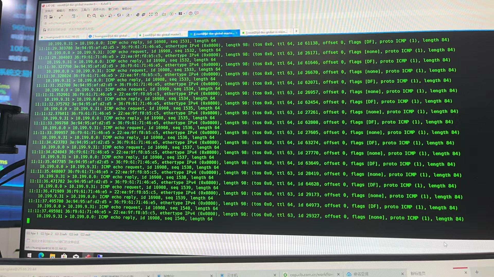
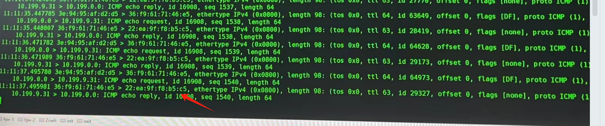
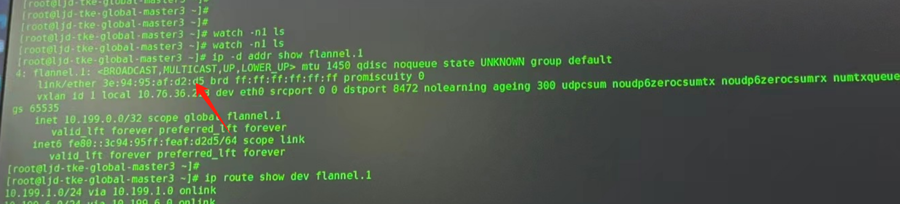
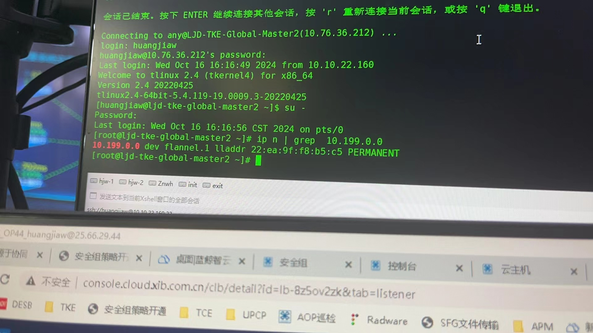

---
kind:
  - Troubleshooting
products:
  - Alauda Container Platform
  - Alauda DevOps
  - Alauda AI
  - Alauda Application Services
  - Alauda Service Mesh
  - Alauda Developer Portal
ProductsVersion:
  - 4.1.0,4.2.x
---
<!-- A type of document that involves encountering a fault, diagnosing it, performing root cause analysis, and providing solutions. -->

# 厦门国际 Flannel 节点重启后，节点上ping其他节点pod不通。

节点重启后，所有Pod访问该节点api-server不通 从master3节点ping其他节点Pod不通

## Cause
- systemd覆盖了flannel.x网卡的MAC地址导致ARP/FDB规则失效

## Resolution
- 创建/etc/systemd/network/50-flannel.link文件并设置：[Match]
OriginalName=flannel*
[Link]
MACAddressPolicy=none
- 重启系统

## [workaround]
- 重启其他所有节点的flanneld pod刷新ARP/FDB规则

## [Related Information]
**Screenshots**

- Environment: CNI版本：flannel 0.10.0
- flannel.1网卡
- iptables
- /etc/systemd/network/50-flannel.link
- flanneld pod
- MACAddressPolicy
- Component: Kubernetes
- Page ID: 240812854
- Original Title: 厦门国际 Flannel 节点重启后，节点上ping其他节点pod不通。
