---
kind:
  - Troubleshooting
products:
  - Alauda Container Platform
  - Alauda DevOps
  - Alauda AI
  - Alauda Application Services
  - Alauda Service Mesh
  - Alauda Developer Portal
ProductsVersion:
  - 4.1.0,4.2.x
---
<!-- A type of document that involves encountering a fault, diagnosing it, performing root cause analysis, and providing solutions. -->

# 郑州银行，3.12.3underlay 集群，节点访问pod 偶现延迟很高

节点访问同节点上的容器，同节点上的容器互相访问延迟偶现很高 ovs-vswitchd 有较多的 WARN log 打印 underlay网卡 enp3s0 到 pod 虚拟网卡存在约18秒延迟

## Cause
- ovs-vswitchd 处理报文时 CPU 占用高
- 交换机 vlan 配置允许所有报文可能导致广播风暴或无效流量
- 节点 CPU 资源不足或配置不当

## Resolution
- 排查节点 CPU 使用情况并优化资源分配
- 修改交换机配置仅允许必要的 vlan 报文通过
- 分析 ovs-vswitchd 的 WARN log 以定位具体问题

## [workaround]
- 调整交换机配置为仅允许配置的 vlan 报文通过（已部分缓解）

## [Related Information]
**Screenshots**
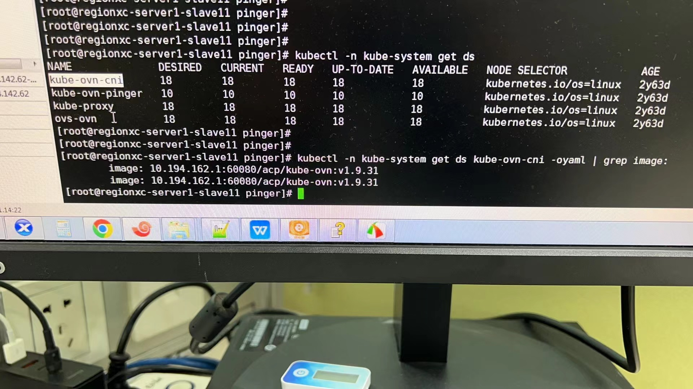
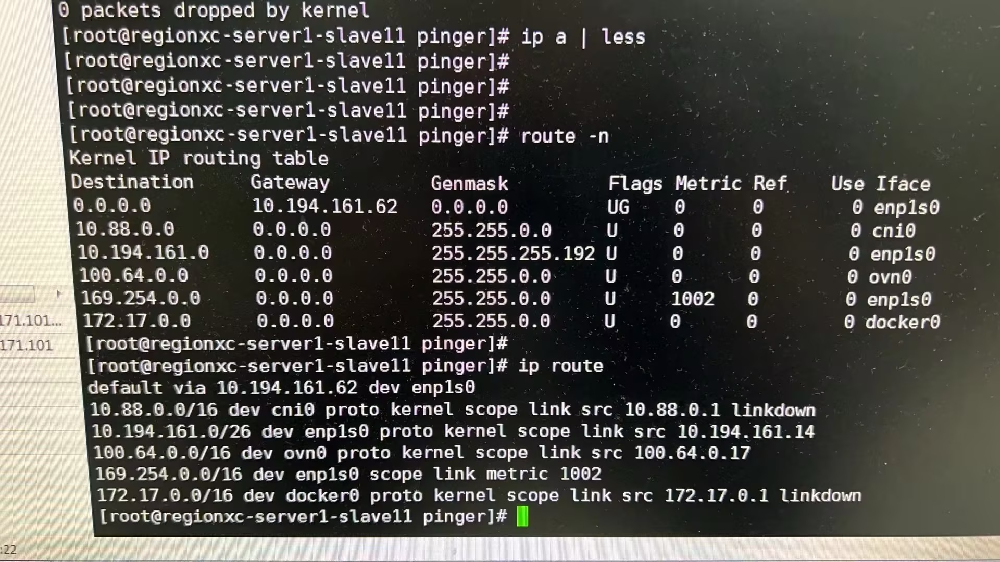
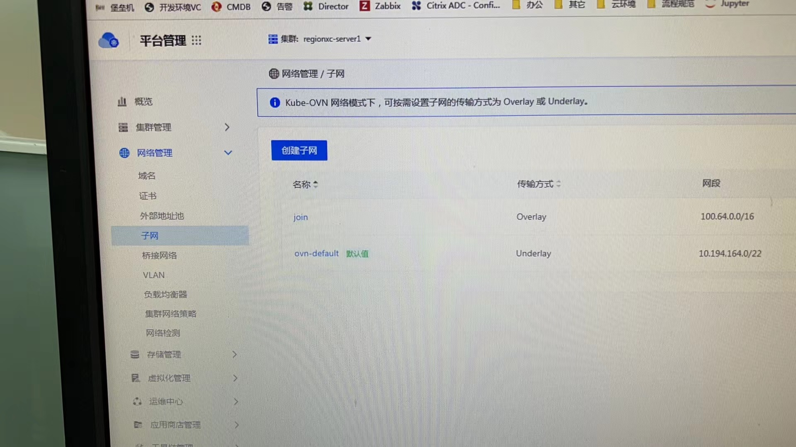
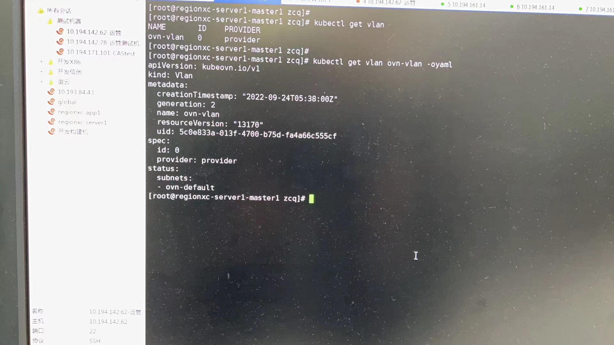
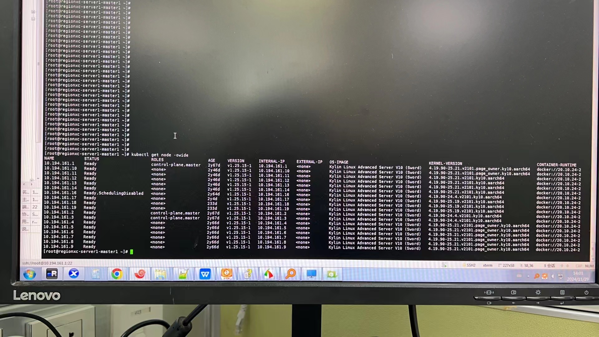
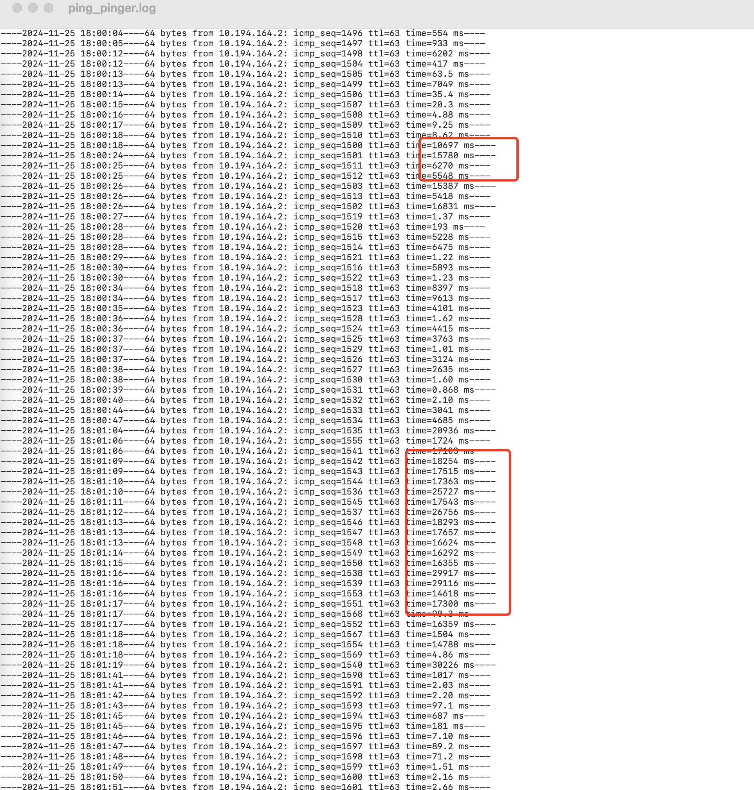
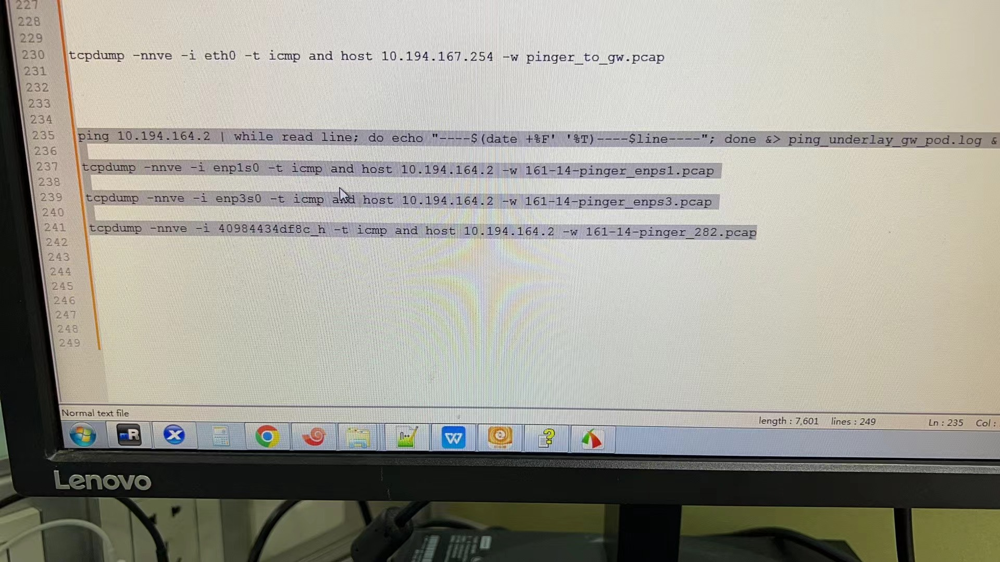
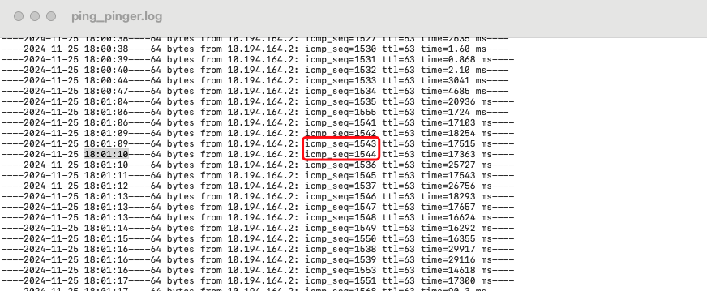

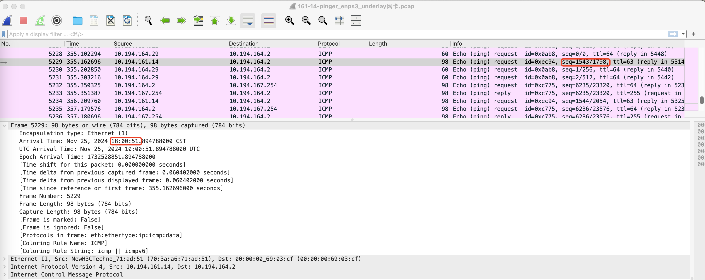
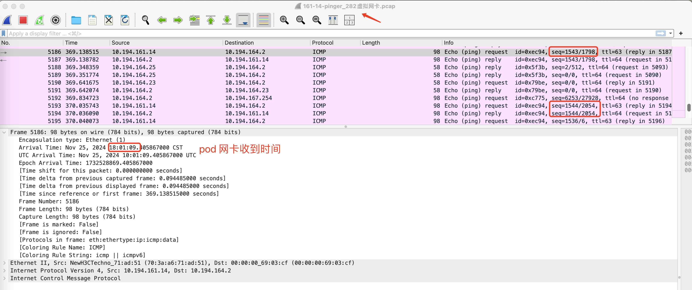
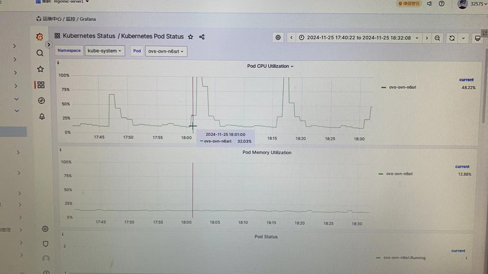
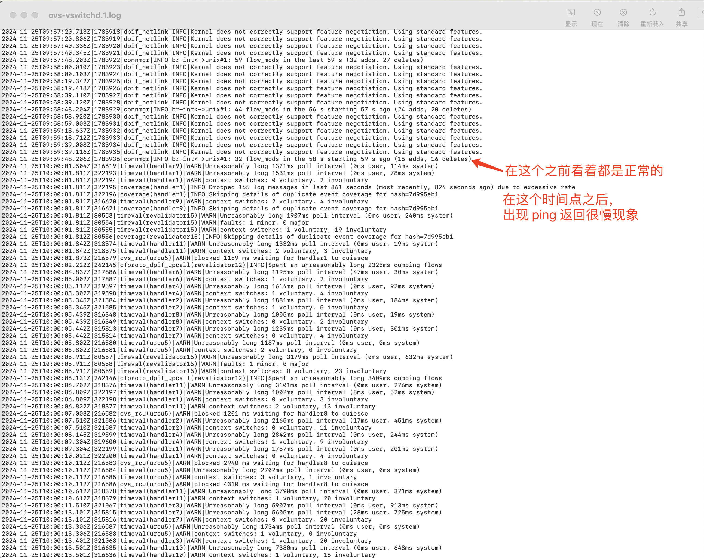
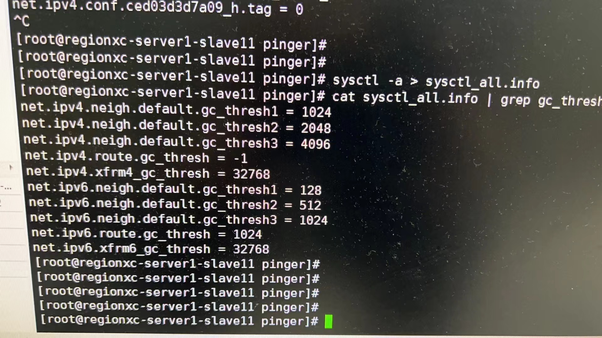
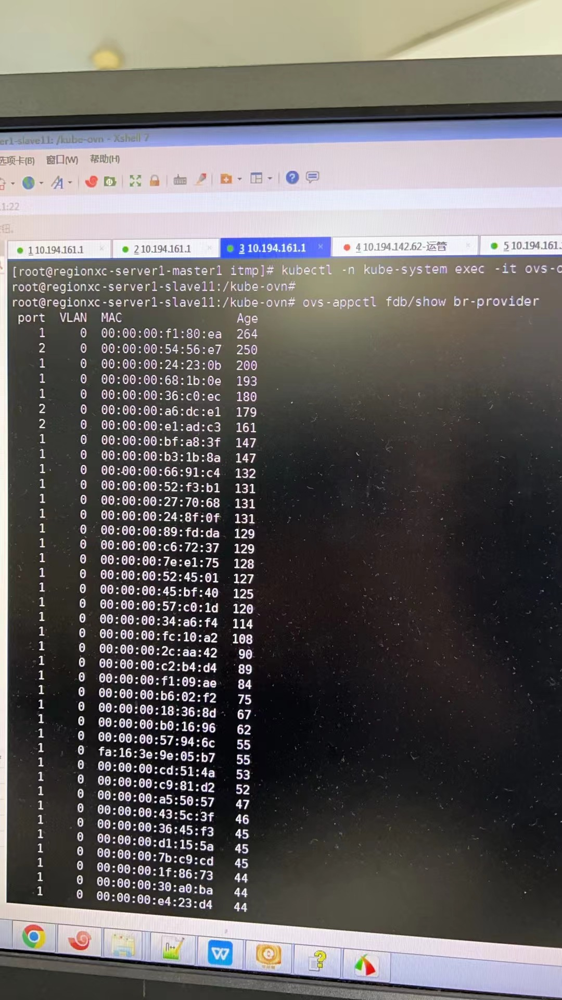
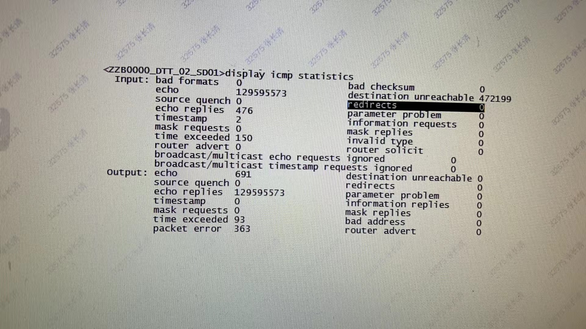
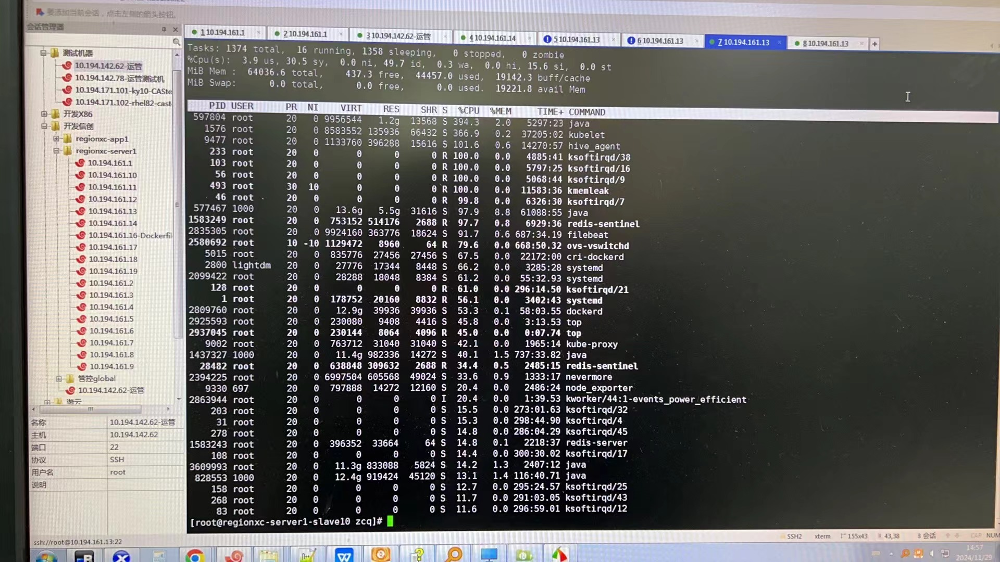

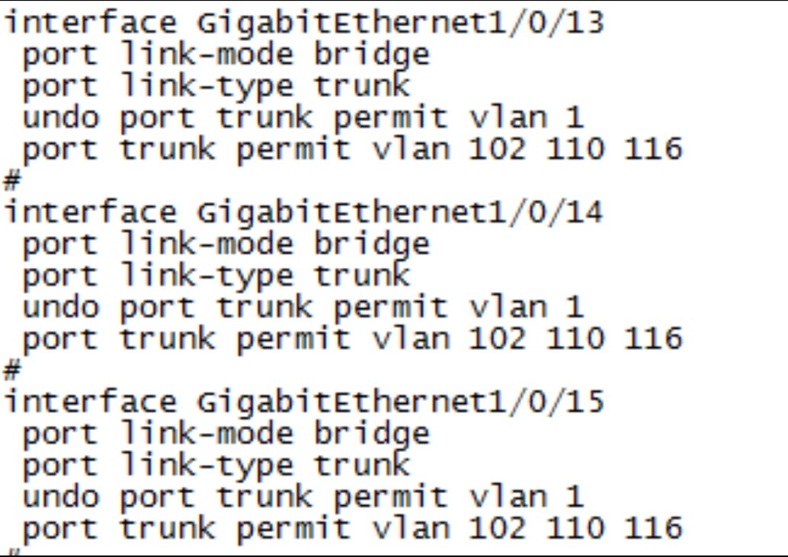
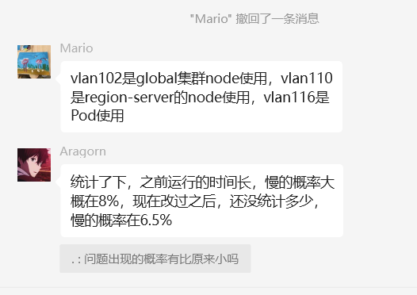
- Environment: 麒麟10 信创arm，Kube-OVN 1.9.35，ACP 3.12.3，18节点 underlay 集群
- ovs-vswitchd
- ovn-controller
- enp3s0
- vlan
- fdb 转发表
- Component: Kubernetes
- Page ID: 248643842
- Original Title: 郑州银行，3.12.3underlay 集群，节点访问pod 偶现延迟很高
